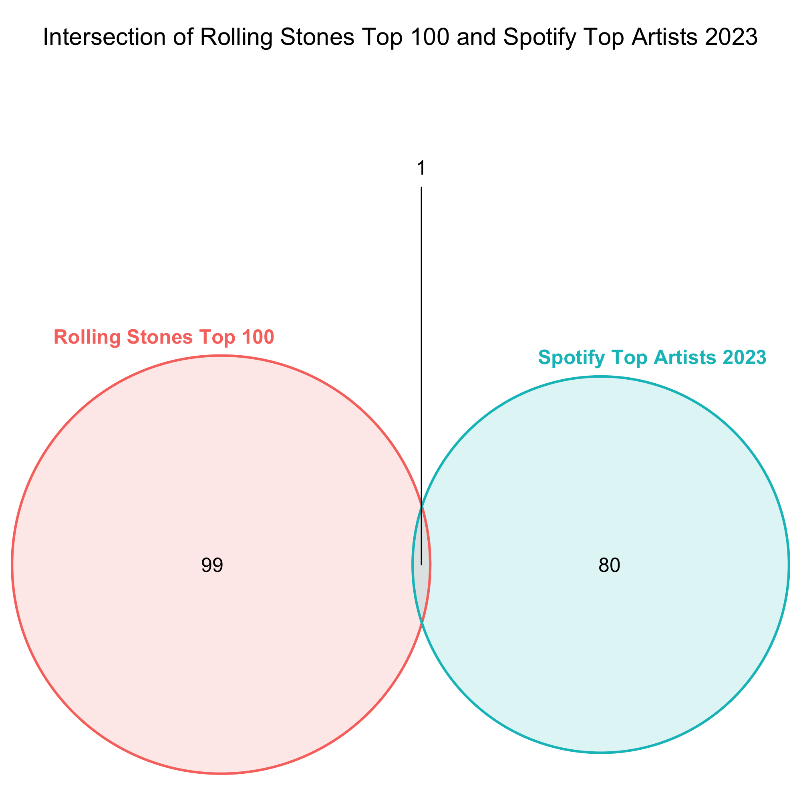
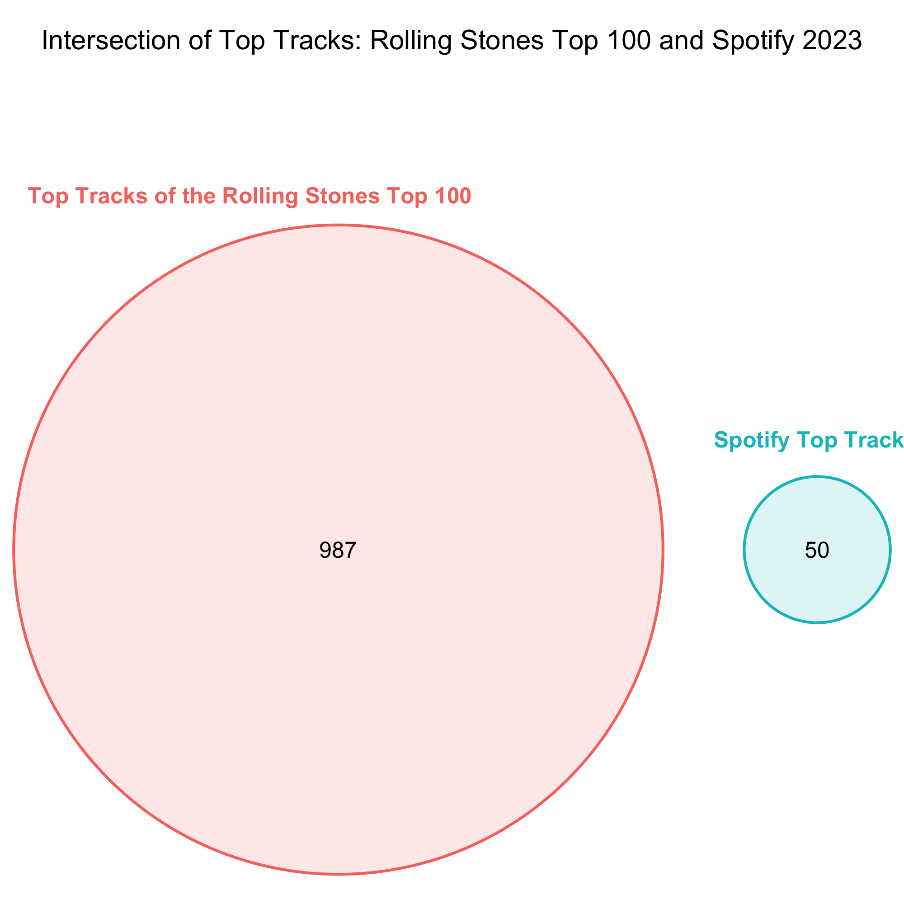

```{r setup, include=FALSE} 
#####################################
# SETUP
#####################################

knitr::opts_chunk$set(echo = FALSE) 

#####################################
# Install/load packages
#####################################


```


## GitHub

The GitHub repository for **this assignment** can be found [here](https://github.com/emmi3105/472_final).

## Task

### Research question:

"_Rolling Stone_ Magazine ranked their 100 greatest musical artists of all time. At the end of 2023, how has their music endured? Are there any features or characteristics that seem to explain enduring engagement? 

### Required data sources:

- [Rolling Stone's 100 Greatest Artists, 2010](https://www.rollingstone.com/music/music-lists/100-greatest-artists-147446/)

- [Spotify Web API](https://developer.spotify.com/documentation/web-api)


Ideas:

- Who were the articles written by/who did the rankings?
  - Men?
  - Older people?

- Potentially, nowadays, mostly the new generation decides what's popular on spotify
  - They want female artists
  - And shorter songs -> by newer artists ("TikTok" songs)
  
  
- Idea: plot the average duration of the most popular songs of the top 100 artists against the average duration of the songs in the top 50 global playlist

-> Nowadays, songs "go viral" on social media

3 fields of analysis to find out the endurement

1. Performance on spotify

2. Concerts/Events
  - Idea. Before attending an event/concert by a specifiy artist, the people who will attend might listen to their music much more
  
3. Social Media presence


Data:

- Rolling Stones top 100 artists
- Spotify API
  - Top 100 artist information
  - Top 100 tracks
  - Top tracks 2023 US
- Ticketmaster API
- Social Media data?


```{r echo=FALSE,out.width="30%", out.height="30%",fig.cap="caption",fig.show='hold',fig.align='center'}
img1 <- 
img2 <- knitr::include_graphics("venn_diagramm_groups.png")
img3 <- 

knitr::include_graphics(c(img1, img2, img3))
```


  
