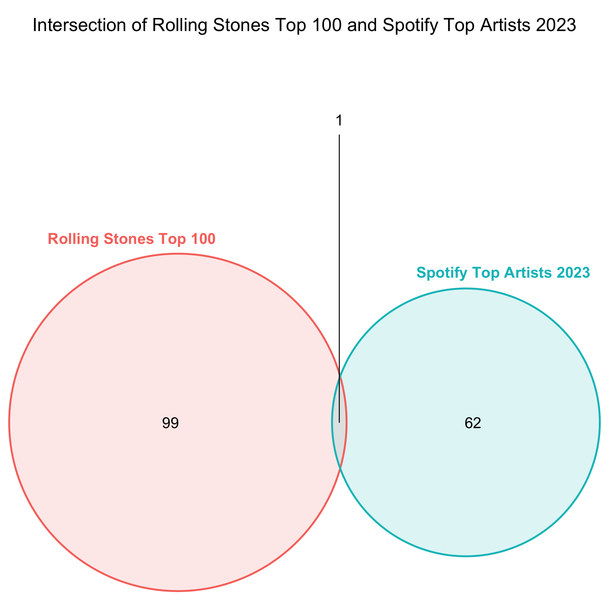

```{r setup, include=FALSE} 
#####################################
# SETUP
#####################################

knitr::opts_chunk$set(echo = FALSE) 

#####################################
# Install/load packages
#####################################

library(tidyverse)
library(RSelenium)
library(netstat)
library(DBI)
library(RSQLite)
library(purrr)
library(httr)
library(base64enc)
library(jsonlite)
library(rvest)
```


## GitHub

The GitHub repository for **this assignment** can be found [here](https://github.com/emmi3105/472_final).

## Task

### Research question:

"_Rolling Stone_ Magazine ranked their 100 greatest musical artists of all time. At the end of 2023, how has their music endured? Are there any features or characteristics that seem to explain enduring engagement? 

### Required data sources:

- [Rolling Stone's 100 Greatest Artists, 2010](https://www.rollingstone.com/music/music-lists/100-greatest-artists-147446/)

- [Spotify Web API](https://developer.spotify.com/documentation/web-api)


Ideas:

- Who were the articles written by/who did the rankings?
  - Men?
  - Older people?

- Potentially, nowadays, mostly the new generation decides what's popular on spotify
  - They want female artists
  - And shorter songs -> by newer artists ("TikTok" songs)
  
  
- Idea: plot the average duration of the most popular songs of the top 100 artists against the average duration of the songs in the top 50 global playlist

-> Nowadays, songs "go viral" on social media

3 fields of analysis to find out the endurement

1. Performance on spotify

2. Concerts/Events
  - Idea. Before attending an event/concert by a specifiy artist, the people who will attend might listen to their music much more
  
3. Social Media presence


Data:

- Rolling Stones top 100 artists
- Spotify API
  - Top 100 artist information
  - Top 100 tracks
  - Top tracks 2023 US
- Ticketmaster API
- Social Media data?


## 1. Introduction 

```{r create a relational database}

################################################################################
# Step 1: Create a relational database

# Create database
db <- dbConnect(RSQLite::SQLite(), "data/spotify.sqlite")

# Check existence of the database
print(file.exists("data/spotify.sqlite"))
```

```{r check_table function}

# Function that checks whether a table exists in the relational database
check_table <- function(db, a_table){
  
  # Check if the "a_table" exists
  if (a_table %in% dbListTables(db)) {
    
    # Get the row count
    query <- paste("SELECT COUNT(*) FROM", a_table)
    row_count <- dbGetQuery(db, query)[1, 1]
    
    # Get the column names
    column_names <- as.character(dbListFields(db, a_table))
    
    # Get the column count
    column_count <- length(unlist(column_names))
    
    # Print out dimensions and column names
    formatted_string <- sprintf("The table %s exists and has the following dimensions: \nNumber of rows: %s \nNumber of columns: %s", a_table, row_count, column_count)
    column_answer <- sprintf("Column names: %s", paste(column_names, collapse = ", "))
    
    return(cat(formatted_string, column_answer, sep = "\n"))
    
  } else {
    # If "a_table" does not exist, return this statement:
    return(cat("The table does not exist."))
  }
}
```


## 2. Data

```{r get rolling stones data, eval=FALSE}

################################################################################
# Step 2: Get the data

################################################################################
# Step 2A: Rolling Stones data

# Launch the driver and browser
invisible(capture.output({
  rD <- rsDriver(browser=c("firefox"), port = free_port(random = TRUE), chromever = NULL) 
  driver <- rD$client
}))

# Navigate to the website
url <- "https://www.rollingstone.com/music/music-lists/100-greatest-artists-147446/"
driver$navigate(url)

# Reject the privacy policies
reject_button <- driver$findElement(using = "xpath", 
                                    value = '//*[@id="onetrust-reject-all-handler"]')
# Click on the button:
reject_button$clickElement()

# Create a data frame that will later hold the top 100 artists
top_hundred_artists_df <- data.frame(
  Artist_Name = character(0),
  Ranking = numeric(0),
  Article_Text = character(0),
  stringsAsFactors = FALSE
)

# Add 100 empty rows
top_hundred_artists_df <- top_hundred_artists_df[rep(NA, 100), ]

# Click the load more button
load_more <- function(){
  # Load more button
  load_more_button <- driver$findElement(using = "xpath", 
                                      value = '/html/body/div[5]/main/div[2]/div[1]/div/article/div[3]/div[2]/div[2]/a')
  # Click on the button:
  load_more_button$clickElement()
}

# Click the load previous button
load_previous <- function(){
  # Load more button
  load_previous_button <- driver$findElement(using = "xpath", 
                                         value = '/html/body/div[5]/main/div[2]/div[1]/div/article/div[3]/div[2]/div[1]')
  # Click on the button:
  load_previous_button$clickElement()
}

# Extract the rankings
extract_rank <- function(){
  # Find all elements with the class name "c-gallery-vertical-album__number"
  artist_rank_elements <- driver$findElements(using = "class name", value = "c-gallery-vertical-album__number")
  
  # Extract text from each element
  artist_ranks <- sapply(artist_rank_elements, function(element) element$getElementText()[[1]])
  
  # Print or use the extracted information
  return(artist_ranks)
}

# Extract the artist names
extract_artist_names <- function(){
  # Find all elements with the class name "c-gallery-vertical-album__title"
  artist_name_elements <- driver$findElements(using = "class name", value = "c-gallery-vertical-album__title")
  
  # Extract text from each element
  artist_names <- sapply(artist_name_elements, function(element) element$getElementText()[[1]])
  
  # Print or use the extracted information
  return(artist_names)
}

# Extract the article text
extract_article_text <- function(){
  # Find all elements with the class name "c-gallery-vertical-album__title"
  article_text_elements <- driver$findElements(using = "class name", value = "c-gallery-vertical-album__description")
  
  # Extract text for the first 50 elements
  article_text <- sapply(article_text_elements, function(element) element$getElementText()[[1]])
  
  # Print or use the extracted information
  return(article_text)
}

# Scrape the data
scrape_artist_rankings <- function(){
  # Assign values from the vector to the first 50 rows of the "Ranking" column in top_hundred_artists_df
  top_hundred_artists_df$Ranking[1:50] <- extract_rank()
  top_hundred_artists_df$Artist_Name[1:50] <- extract_artist_names()
  top_hundred_artists_df$Article_Text[1:50] <- extract_article_text()

  # Click the load more button
  load_more()
  Sys.sleep(2)

  # Assign values from the vector to the last 50 rows of the "Ranking" column in top_hundred_artists_df
  top_hundred_artists_df$Ranking[51:100] <- extract_rank()
  top_hundred_artists_df$Artist_Name[51:100] <- extract_artist_names()
  top_hundred_artists_df$Article_Text[51:100] <- extract_article_text()
  
  return(top_hundred_artists_df)
}

# Call the artist ranking web scraping function
top_hundred_artists_df <- scrape_artist_rankings()

# Save the data frame as a global variable
assign("top_hundred_artists_df", top_hundred_artists_df, envir = .GlobalEnv)

# Save the data frame as an RData file in the current working directory
save(top_hundred_artists_df, file = "data/top_hundred_artists_data.RData")
```


```{r load the Rolling Stones data}

# Load the data from the RData file
load("data/top_hundred_artists_data.RData")

# Make a copy of the data frame
top_hundred_artists <- data.frame(top_hundred_artists_df)
```


```{r close the RSelenium procsses, eval=FALSE}

# Close the RSelenium processes:
driver$close()
# Close the associated Java processes
system("taskkill /im java.exe /f", intern=FALSE, ignore.stdout=FALSE)
```


```{r get Spotify API data, eval=FALSE}

################################################################################
# Step 2B: Spotify API data

readRenviron("../../Documents/R_Environs/spotify_api.env")
client_id <- Sys.getenv("CLIENT_ID")
client_secret <- Sys.getenv("CLIENT_SECRET")

# Create a base64-encoded string of the client ID and client secret
credentials <- paste0(client_id, ':', client_secret)
base64_credentials <- base64enc::base64encode(charToRaw(credentials))

# Set up the authentication request
auth_response <- httr::POST(
  'https://accounts.spotify.com/api/token',
  add_headers(
    Authorization = paste0('Basic ', base64_credentials),
    'Content-Type' = 'application/x-www-form-urlencoded'
  ),
  body = list(grant_type = 'client_credentials'),
  encode = 'form'
)

# Check for HTTP errors
if (http_error(auth_response)) {
  print(status_code(auth_response))
  print(content(auth_response, "text"))
} else {
  # Extract the access token from the response
  access_token <- httr::content(auth_response)$access_token
}

# 1) Get the artist ID given the artist name 

get_artist_id <- function(artist_name) {
  # Define the Spotify API endpoint for searching an artist
  search_url <- 'https://api.spotify.com/v1/search'
  
  # Set up the request with the access token
  search_response <- GET(
    search_url,
    query = list(q = artist_name, type = 'artist'),
    add_headers(Authorization = paste0('Bearer ', access_token))
  )
  
  # Extract the artist ID from the response
  search_results <- content(search_response, "parsed")
  
  # Check if any results were returned
  if (length(search_results$artists$items) > 0) {
    artist_id <- search_results$artists$items[[1]]$id
    return(artist_id)
  } else {
    # Return NA or any other value to indicate no match
    return(NA)
  }
}

# Apply the function to the entire "Artist_Name" column in the data frame
top_hundred_artists$Spotify_Artist_ID <- sapply(top_hundred_artists$Artist_Name, get_artist_id)

# 2) Get the artist info given the artist ID 
get_artist_info <- function(artist_id){
  # Define the Spotify API endpoint for getting information about an artist
  artist_url <- paste0('https://api.spotify.com/v1/artists/', artist_id)
  
  # Set up the request with the access token
  artist_response <- GET(artist_url, add_headers(Authorization = paste0('Bearer ', access_token)))
  
  # Extract the artist information from the response
  artist_info <- content(artist_response)
  
  followers <- artist_info$followers$total[1]
  genres <- artist_info$genres[1]
  popularity <- artist_info$popularity
  
  # Create a list with the extracted information
  artist_data <- list(followers = followers, genres = genres, popularity = popularity)
  
  return(artist_data)
}

# Apply the function to the entire "Artist_Name" column in the data frame
result <- lapply(top_hundred_artists$Spotify_Artist_ID, get_artist_info)

# Extract individual elements
top_hundred_artists$Followers <- sapply(result, function(x) x$followers)
top_hundred_artists$Genres <- sapply(result, function(x) x$genres)
top_hundred_artists$Popularity <- sapply(result, function(x) x$popularity)


# Remove the row names
top_hundred_artists <- data.frame(top_hundred_artists, row.names = NULL)
# Transform the "Genres" column into type character 
top_hundred_artists$Genres <- sapply(top_hundred_artists$Genres, function(x) paste(x, collapse = ","))

# 3) Get the release date of the latest album

# Create an empty data frame for the top tracks
album_data <- data.frame(
  Spotify_Artist_ID = character(0),
  Artist_Name = character(0),
  Spotify_Album_ID = character(0),
  Album_Name = character(0),
  Album_Release_Date = character(0),
  Number_of_Tracks = numeric(0),
  stringsAsFactors = FALSE
)

get_album_data <- function(the_artist_id){
  
  album_url <- paste0('https://api.spotify.com/v1/artists/', the_artist_id, '/albums')
  # Set up the request with the access token
  album_response <- GET(album_url, 
                        add_headers(Authorization = paste0('Bearer ', access_token)))
  
  album_info <- content(album_response)
  
  return(album_info)
}

# Function that gets the album data given the artist ID and using the function get_album_data
get_albums <- function(the_artist_id) {
  
  # Get the data given the artist id
  albums <- get_album_data(the_artist_id)
  
  # Loop through the top tracks for each artist
  if (!is.null(albums$items) && length(albums$items) > 0) {
    # Enter the loop
    for (i in seq(length(albums$items))) {
  
      # Check and extract values, appending NA if a value is missing
      album_data <- rbind(album_data, data.frame(
        Spotify_Artist_ID = ifelse(!is.null(the_artist_id), the_artist_id, NA),
        Artist_Name = ifelse(!is.null(albums$items[[i]]$artists[[1]]$name), albums$items[[i]]$artists[[1]]$name, NA),
        Spotify_Album_ID = ifelse(!is.null(albums$items[[i]]$id), albums$items[[i]]$id, NA),
        Album_Name = ifelse(!is.null(albums$items[[i]]$name), albums$items[[i]]$name, NA),
        Album_Release_Date = ifelse(!is.null(albums$items[[i]]$release_date), albums$items[[i]]$release_date, NA),
        Number_of_Tracks = ifelse(!is.null(albums$items[[i]]$total_tracks), albums$items[[i]]$total_tracks, NA)
        ))
    }
  } else {
    album_data <- rbind(album_data, data.frame(
      Spotify_Artist_ID = the_artist_id,
      Artist_Name = NA,
      Spotify_Album_ID = NA,
      Album_Name = NA,
      Album_Release_Date = NA,
      Number_of_Tracks = NA))
  }
  
  return(album_data)
}

result_list <- lapply(top_hundred_artists$Spotify_Artist_ID, get_albums)
album_data <- do.call(rbind, result_list)


album_data <- album_data %>%
  mutate(
    is_full_date = grepl("\\d{4}-\\d{2}-\\d{2}", Album_Release_Date),
    Album_Release_Date = case_when(
      is_full_date ~ as.Date(Album_Release_Date, format = "%Y-%m-%d"),
      TRUE ~ as.Date(paste0(Album_Release_Date, "-01-01"), format = "%Y-%m-%d")
    )
  )

# Remove the temporary column
album_data$is_full_date <- NULL

# Group by Artist_ID and find the latest album release date
Latest_Album_Release <- album_data %>%
  group_by(Spotify_Artist_ID) %>%
  summarize(Latest_Album_Release = max(Album_Release_Date, na.rm = TRUE))

# Merge the result back into top_hundred_artists
top_hundred_artists <- merge(top_hundred_artists, Latest_Album_Release, by = "Spotify_Artist_ID", all.x = TRUE)

top_hundred_artists$Latest_Album_Release <- as.character(top_hundred_artists$Latest_Album_Release)

# Write top_hundred_artists_df to the relational database
dbWriteTable(db, "top_hundred_artists_df", top_hundred_artists, overwrite = TRUE)

```

```{r call check_table on "top_hundred_artists_df"}

# Call check_table on "top_hundred_artists_df"
check_table(db, "top_hundred_artists_df")
```

```{r get the artist top tracks, eval=FALSE}

# 4) Get the artist top tracks

# Create an empty data frame for the top tracks
top_tracks_data <- data.frame(
  Spotify_Artist_ID = character(0),
  Artist_Name = character(0),
  Spotify_Track_ID = character(0),
  Track_Name = character(0),
  Track_Popularity = numeric(0),
  Track_Duration = numeric(0),
  Album_Release_Date = character(0),
  stringsAsFactors = FALSE
)

# Function that queries the API for each artist's top track data given their ID
get_track_data <- function(the_artist_id, market="US") {
  # Define the Spotify API endpoint for getting an artist's top tracks
  top_tracks_url <- paste0('https://api.spotify.com/v1/artists/', the_artist_id, '/top-tracks?market=', market)
  
  # Set up the request with the access token
  top_tracks_response <- GET(
    top_tracks_url,
    add_headers(Authorization = paste0('Bearer ', access_token))
  )
  
  # Extract the top tracks from the response
  top_tracks <- content(top_tracks_response, "parsed")
  
  return(top_tracks)
}

# Function that gets further info on the top tracks given the artist ID and using the function get_track_data
get_top_tracks <- function(the_artist_id) {
  
  # Get the data given the artist ID
  top_tracks <- get_track_data(the_artist_id)
  
  # Loop through the top tracks for each artist
  if (!is.null(top_tracks$tracks) && length(top_tracks$tracks) > 0) {
    # Enter the loop
    for (i in seq(length(top_tracks$tracks))) {
      # Calculate Collaboration value for each song
      collaboration_value <- ifelse(length(top_tracks$tracks[[i]]$artists) > 1, 1, 0)
      
      # Check and extract values, appending NA if a value is missing
      top_tracks_data <- rbind(top_tracks_data, data.frame(
        Spotify_Artist_ID = ifelse(!is.null(top_tracks$tracks[[i]]$artists[[1]]$id), the_artist_id, NA),
        Artist_Name = ifelse(!is.null(top_tracks$tracks[[i]]$artists[[1]]$name), top_tracks$tracks[[i]]$artists[[1]]$name, NA),
        Spotify_Track_ID = ifelse(!is.null(top_tracks$tracks[[i]]$id), top_tracks$tracks[[i]]$id, NA),
        Track_Name = ifelse(!is.null(top_tracks$tracks[[i]]$name), top_tracks$tracks[[i]]$name, NA),
        Track_Popularity = ifelse(!is.null(top_tracks$tracks[[i]]$popularity), top_tracks$tracks[[i]]$popularity, NA),
        Track_Duration = ifelse(!is.null(top_tracks$tracks[[i]]$duration_ms), top_tracks$tracks[[i]]$duration_ms, NA),
        Album_Release_Date = ifelse(!is.null(top_tracks$tracks[[i]]$album$release_date), top_tracks$tracks[[i]]$album$release_date, NA),
        Collaboration = collaboration_value
      ))
    }
  } else {
    top_tracks_data <- rbind(top_tracks_data, data.frame(
      Spotify_Artist_ID = the_artist_id,
      Artist_Name = NA,
      Spotify_Track_ID = NA,
      Track_Name = NA,
      Track_Popularity = NA,
      Track_Duration = NA,
      Album_Release_Date = NA,
      Collaboration = NA
    ))
  }
  
  return(top_tracks_data)
}

result_list <- lapply(top_hundred_artists$Spotify_Artist_ID, get_top_tracks)
top_tracks_data <- do.call(rbind, result_list)

# Clean the top_tracks_data
top_tracks_data <- top_tracks_data %>%
  mutate(
    is_full_date = grepl("\\d{4}-\\d{2}-\\d{2}", Album_Release_Date),
    Album_Release_Date = case_when(
      is_full_date ~ as.Date(Album_Release_Date, format = "%Y-%m-%d"),
      TRUE ~ as.Date(paste0(Album_Release_Date, "-01-01"), format = "%Y-%m-%d")
    )
  )

# Remove the temporary column
top_tracks_data$is_full_date <- NULL

# Write top_tracks_data to the relational database
dbWriteTable(db, "top_tracks_df", top_tracks_data, overwrite = TRUE)
```


```{r call check_table on "top_tracks_df"}

# Call check_table on "top_tracks_df"
check_table(db, "top_tracks_df")
```

Getting the playlists:
Improve the code so that one set of functions can be used for any playlist

```{r get the spotify top tracks of 2023, eval=FALSE}

# 5) Get the Spotify playlist "Top Tracks of 2023, USA"

# Get a playlist
get_playlist <- function(playlist_id){
 
  # Spotify API endpoint for getting playlist details
  endpoint <- paste0('https://api.spotify.com/v1/playlists/', playlist_id)
  
  # Set up the request headers with the access token
  headers <- c('Authorization' = paste0('Bearer ', access_token))
  
  # Make the GET request
  playlist_response <- GET(endpoint, add_headers(headers))
  playlist_data <- content(playlist_response, 'parsed')
  
  return(playlist_data)
}


# Create an empty dataframe
top_tracks_2023_USA <- data.frame(
  Playlist_Name = character(0),
  Playlist_ID = character(0),
  Playlist_Description = character(0),
  Track_Name = character(0),
  Artist_Name = character(0),
  Spotify_Track_ID = character(0),
  Track_Duration = numeric(0),
  Track_Popularity = numeric(0),
  Album_Release_Date = character(0),
  stringsAsFactors = FALSE
)

# Function that gets the playlist info given the playlist id
get_playlist_info <- function(playlist_id, a_dataframe) {
  
  # Get the playlist data given the playlist id
  dt <- get_playlist(playlist_id)
  
  # Loop to append values
  for (i in seq(length(dt$tracks$items))) {
    # Append the values to the dataframe
    a_dataframe <- rbind(a_dataframe, data.frame(Playlist_Name = dt$name,
                                                 Playlist_ID = dt$id,
                                                 Playlist_Description = dt$description,
                                                 Track_Name = dt$tracks$items[[i]]$track$name,
                                                 Artist_Name = dt$tracks$items[[i]]$track$artists[[1]]$name,
                                                 Spotify_Track_ID = dt$tracks$items[[i]]$track$id,
                                                 Track_Duration = dt$tracks$items[[i]]$track$duration_ms,
                                                 Track_Popularity = dt$tracks$items[[i]]$track$popularity,
                                                 Album_Release_Date = dt$tracks$items[[i]]$track$album$release_date
                                                 ))
  }
  
  # Return the resulting dataframe
  return(a_dataframe)
}

# Execute the function
top_tracks_2023_USA_id <- "37i9dQZF1DXbJMiQ53rTyJ"
top_tracks_2023_USA <- get_playlist_info(top_tracks_2023_USA_id, top_tracks_2023_USA)

# Get the artist ID for each artist on the top tracks 2023 playlist
top_tracks_2023_USA$Spotify_Artist_ID <- NA

# Function to search for artist by name and get the artist ID
get_artist_id <- function(artist_name) {
  # Spotify API endpoint for searching artists by name
  endpoint <- 'https://api.spotify.com/v1/search'
  
  # Set up the request parameters with a filter for artists
  params <- list(q = artist_name, type = 'artist', limit = 1)
  
  # Set up the request headers with the access token
  headers <- c('Authorization' = paste0('Bearer ', access_token))
  
  # Make the GET request
  response <- GET(endpoint, query = params, add_headers(headers))
  
  search_result <- content(response, 'parsed')
  
  id <- search_result$artists$items[[1]]$id
  
  return(id)
}

# Add the artist IDs
top_tracks_2023_USA$Spotify_Artist_ID <- lapply(top_tracks_2023_USA$Artist_Name, get_artist_id)
top_tracks_2023_USA$Spotify_Artist_ID <- as.character(top_tracks_2023_USA$Spotify_Artist_ID)

# Write top_tracks_2023_USA to the relational database
dbWriteTable(db, "top_tracks_2023_USA_df", top_tracks_2023_USA, overwrite = TRUE)
```


```{r call check_table on "top_tracks_2023_USA_df"}

# Call check_table on "top_tracks_2023_USA_df"
check_table(db, "top_tracks_2023_USA_df")
```

Explain why you only look at the US (link to the US-centrism of the Rolling Stones ranking)

```{r get the spotify top artists 2023 USA, eval=FALSE}

# 6) Get the Spotify playlist "Top Artists of 2023, USA"

# Create an empty dataframe
top_artists_2023_USA <- data.frame(
  Playlist_Name = character(0),
  Playlist_ID = character(0),
  Playlist_Description = character(0),
  Track_Name = character(0),
  Artist_Name = character(0),
  Spotify_Track_ID = character(0),
  Track_Duration = numeric(0),
  Track_Popularity = numeric(0),
  Album_Release_Date = character(0),
  stringsAsFactors = FALSE
)

# A playlist dataframe
top_artists_USA_id <- "37i9dQZF1DX4dwwIoKH0j7"
top_artists_2023_USA <- get_playlist_info(top_artists_USA_id, top_artists_2023_USA)

# Get the information on the tracks of the playlist
get_tracks_23 <- function(track_id){
  
  # Spotify API endpoint for getting playlist details
  endpoint <- paste0('https://api.spotify.com/v1/tracks/', track_id)
  
  # Set up the request headers with the access token
  headers <- c('Authorization' = paste0('Bearer ', access_token))
  
  # Make the GET request
  tracks_23_response <- GET(endpoint, add_headers(headers))
  tracks_23_data <- content(tracks_23_response, 'parsed')
  
  return(tracks_23_data)
}

top_artists_2023 <- data.frame(
  Artist_Name = character(0),
  stringsAsFactors = FALSE
)

# function that gets the playlist info given the playlist id
get_artists_23 <- function(track_id) {
  
  # Get the playlist data given the playlist id
  dt <- get_tracks_23(track_id)
  
  for (i in seq(length(dt$artists))){
    top_artists_2023 <- rbind(top_artists_2023, data.frame(Artist_Name = dt$artists[[i]]$name))
  }
  
  # Return the resulting dataframe
  return(top_artists_2023)
}

top_artists_2023 <- get_artists_23("0vjeOZ3Ft5jvAi9SBFJm1j")


result_list <- lapply(top_artists_2023_USA$Spotify_Track_ID, get_artists_23)
top_artists_2023 <- do.call(rbind, result_list)

# Get the artist ID
top_artists_2023$Spotify_Artist_ID <- lapply(top_artists_2023$Artist_Name, get_artist_id)

# Get the artists' popularity
top_artists_2023$Popularity <- NA

# Function to search for artist by name and get the artist ID
get_popularity <- function(artist_name) {
  # Spotify API endpoint for searching artists by name
  endpoint <- 'https://api.spotify.com/v1/search'
  
  # Set up the request parameters with a filter for artists
  params <- list(q = artist_name, type = 'artist', limit = 1)
  
  # Set up the request headers with the access token
  headers <- c('Authorization' = paste0('Bearer ', access_token))
  
  # Make the GET request
  response <- GET(endpoint, query = params, add_headers(headers))
  
  search_result <- content(response, 'parsed')
  
  popularity <- search_result$artists$items[[1]]$popularity
  
  return(popularity)
}

top_artists_2023$Popularity <- lapply(top_artists_2023$Artist_Name, get_popularity)

# Get the artists' followers
top_artists_2023$Followers <- NA

# Function to search for artist by name and get the artist ID
get_followers <- function(artist_name) {
  # Spotify API endpoint for searching artists by name
  endpoint <- 'https://api.spotify.com/v1/search'
  
  # Set up the request parameters with a filter for artists
  params <- list(q = artist_name, type = 'artist', limit = 1)
  
  # Set up the request headers with the access token
  headers <- c('Authorization' = paste0('Bearer ', access_token))
  
  # Make the GET request
  response <- GET(endpoint, query = params, add_headers(headers))
  
  search_result <- content(response, 'parsed')
  
  followers <- search_result$artists$items[[1]]$followers$total
  
  return(followers)
}

top_artists_2023$Followers <- lapply(top_artists_2023$Artist_Name, get_followers)

# Convert list columns to character
top_artists_2023$Spotify_Artist_ID <- as.character(top_artists_2023$Spotify_Artist_ID)
top_artists_2023$Popularity <- as.character(top_artists_2023$Popularity)
top_artists_2023$Followers <- as.character(top_artists_2023$Followers)

# Write top_artists_2023 to the relational database
dbWriteTable(db, "top_artists_2023_USA_df", top_artists_2023, overwrite = TRUE)
```


```{r call check_table on "top_artists_2023_USA_df"}

# Call check_table on "top_artists_2023_USA_df"
check_table(db, "top_artists_2023_USA_df")
```


```{r get the spotify top groups 2023 USA, eval=FALSE}
# 7) Get the Spotify playlist "Top Groups of 2023, USA"

top_groups_2023 <- data.frame(
  Playlist_Name = character(0),
  Playlist_ID = character(0),
  Playlist_Description = character(0),
  Track_Name = character(0),
  Artist_Name = character(0),
  Spotify_Track_ID = character(0),
  Track_Duration = numeric(0),
  Track_Popularity = numeric(0),
  Album_Release_Date = character(0),
  stringsAsFactors = FALSE
)

# A playlist dataframe
top_groups_2023_id <- "37i9dQZF1DX6Q49slBRXI2"
top_groups_2023_dt <- get_playlist_info(top_groups_2023_id, top_groups_2023)

# Get the track info from the playlist 
top_groups_2023 <- data.frame(
  Artist_Name = character(0),
  stringsAsFactors = FALSE
)

# Function that gets the artist info given the track id
get_artists_23 <- function(track_id) {
  
  # Get the playlist data given the playlist id
  dt <- get_tracks_23(track_id)
  
  for (i in seq(length(dt$artists))){
    top_groups_2023 <- rbind(top_groups_2023, data.frame(Artist_Name = dt$artists[[i]]$name))
  }
  
  # Return the resulting dataframe
  return(top_groups_2023)
}

result_list <- lapply(top_groups_2023_dt$Spotify_Track_ID, get_artists_23)
top_groups_2023 <- do.call(rbind, result_list)

# Artist ID
top_groups_2023$Spotify_Artist_ID <- NA
top_groups_2023$Spotify_Artist_ID <- lapply(top_groups_2023$Artist_Name, get_artist_id)

# Artist Popularity
top_groups_2023$Popularity <- NA
top_groups_2023$Popularity <- lapply(top_groups_2023$Artist_Name, get_popularity)

# Artist Followers
top_groups_2023$Followers <- NA
top_groups_2023$Followers <- lapply(top_groups_2023$Artist_Name, get_followers)

# Convert list columns to character
top_groups_2023$Spotify_Artist_ID <- as.character(top_groups_2023$Spotify_Artist_ID)
top_groups_2023$Popularity <- as.character(top_groups_2023$Popularity)
top_groups_2023$Followers <- as.character(top_groups_2023$Followers)

# Write top_groups_2023 to the relational database
dbWriteTable(db, "top_groups_2023_df", top_groups_2023, overwrite = TRUE)
```


```{r call check_table on "top_groups_2023_df"}

# Call check_table on "top_groups_2023_df"
check_table(db, "top_groups_2023_df")
```

```{r get Ticketmaster API data, eval=FALSE}

################################################################################
# Step 2C: Ticketmaster API Data

readRenviron("../../Documents/R_Environs/ticketmaster_api.env")
ticketmaster_apikey <- Sys.getenv("KEY")


get_event_data <- function(artist_name, ticketmaster_apikey){
  # Specify an endpoint (e.g., events)
  endpoint <- "events"
  
  # Build the complete URL
  url <- paste0("https://app.ticketmaster.com/discovery/v2/", endpoint)
  
  # Set query parameters
  params <- list(
    apikey = ticketmaster_apikey,
    countryCode = "US",
    keyword = artist_name,  # Replace with the name of the artist
    startDateTime = "2023-01-01T00:00:00Z",  # Set the start date to filter past events
    endDateTime = "2023-12-31T23:59:59Z"    # Set the end date
    #size = 5 
  )
  
  # Make the GET request
  response <- GET(url, query = params)
  content <- content(response, "parsed") 
  
  return(content)
}

content <- get_event_data("Taylor Swift", ticketmaster_apikey)

event_data <- data.frame(
  Artist_Name = character(0),
  Event_Name = character(0),
  Event_ID = character(0),
  stringsAsFactors = FALSE
)

# function that gets the event data given the artist name
get_ticketmaster_info <- function(artist_name, apikey = ticketmaster_apikey) {
  
  # Get the playlist data given the playlist id
  dt <- get_event_data(artist_name, apikey)
  
  
  # Loop through the top tracks for each artist
  if (!is.null(dt$'_embedded'$events) && length(dt$'_embedded'$events) > 0) {
    # Loop to append values
    for (i in seq(length(dt$'_embedded'$events))) {
      # Append the values to the data frame
      event_data <- rbind(event_data, data.frame(Artist_Name = artist_name,
                                                 Event_Name = dt$'_embedded'$events[[i]]$name,
                                                 Event_ID = dt$'_embedded'$events[[i]]$id
      ))
    }
    
  } else {
    # Print a message or take appropriate action when top_tracks$tracks is NULL or empty
    event_data <- rbind(event_data, data.frame(
      Artist_Name = artist_name,
      Event_Name = NA,
      Event_ID = NA
    ))
  }
  
  # Return the resulting data frame
  return(event_data)
}

result_list <- lapply(top_hundred_artists$Artist_Name, get_ticketmaster_info)
event_data <- do.call(rbind, result_list)

# Clean the data
event_data <- event_data %>%
  # Clean up "The Drifters"
  mutate(
    Event_Name = ifelse(Artist_Name == "The Drifters", NA, Event_Name),
    Event_ID = ifelse(Artist_Name == "The Drifters", NA, Event_ID)
  ) %>%
  filter(!duplicated(Artist_Name) | Artist_Name != "The Drifters")  %>%
  
  # Clean up "Eagles"
  mutate(
    Event_Name = ifelse(Artist_Name == "Eagles", NA, Event_Name),
    Event_ID = ifelse(Artist_Name == "Eagles", NA, Event_ID)
  ) %>%
  filter(!duplicated(Artist_Name) | Artist_Name != "Eagles")  %>%
  
  # Clean up "The Doors"
  mutate(
    Event_Name = ifelse(Artist_Name == "The Doors", NA, Event_Name),
    Event_ID = ifelse(Artist_Name == "The Doors", NA, Event_ID)
  ) %>%
  filter(!duplicated(Artist_Name) | Artist_Name != "The Doors")  %>%
  
  # Clean up "The Police"
  filter(!(Artist_Name == "The Police" & (Event_Name == "Fire Vs Police Flag Football" | Event_Name == "POLICE STATE / GEMM / CENOBITE / DOGPILE"))) %>%
  
  # Clean up "Cream" 
  mutate(
    Event_Name = ifelse(Artist_Name == "Cream", NA, Event_Name),
    Event_ID = ifelse(Artist_Name == "Cream", NA, Event_ID)
  ) %>%
  filter(!duplicated(Artist_Name) | Artist_Name != "Cream")  %>%  
  
  # Clean up "Grateful Dead"
  filter(!(Artist_Name == "Grateful Dead" & (Event_Name == "DEAD NIGHT w/ Grateful Upstate Toodeloo" | Event_Name == "POLICE STATE / GEMM / CENOBITE / DOGPILE"))) %>%
  
  # Clean up "Howlin' Wolf" 
  mutate(
    Event_Name = ifelse(Artist_Name == "Howlin’ Wolf", NA, Event_Name),
    Event_ID = ifelse(Artist_Name == "Howlin’ Wolf", NA, Event_ID)
  ) %>%
  filter(!duplicated(Artist_Name) | Artist_Name != "Howlin’ Wolf")  %>%
  
  # Clean up "Queen"
  filter(!(Artist_Name == "Queen" & Event_Name == "The Snow Queen")) %>%

  # Clean up "The Band" 
  mutate(
    Event_Name = ifelse(Artist_Name == "The Band", NA, Event_Name),
    Event_ID = ifelse(Artist_Name == "The Band", NA, Event_ID)
  ) %>%
  filter(!duplicated(Artist_Name) | Artist_Name != "The Band")  %>%

  # Clean up "The Doors" 
  mutate(
    Event_Name = ifelse(Artist_Name == "The Doors", NA, Event_Name),
    Event_ID = ifelse(Artist_Name == "The Doors", NA, Event_ID)
  ) %>%
  filter(!duplicated(Artist_Name) | Artist_Name != "The Doors")  %>%

  # Clean up "The Who" 
  mutate(
    Event_Name = ifelse(Artist_Name == "The Who", NA, Event_Name),
    Event_ID = ifelse(Artist_Name == "The Who", NA, Event_ID)
  ) %>%
  filter(!duplicated(Artist_Name) | Artist_Name != "The Who")  %>%
      
  # Clean up "Buddy Holly" 
  mutate(
    Event_Name = ifelse(Artist_Name == "Buddy Holly", NA, Event_Name),
    Event_ID = ifelse(Artist_Name == "Buddy Holly", NA, Event_ID)
  ) %>%
  filter(!duplicated(Artist_Name) | Artist_Name != "Buddy Holly")  %>%
    
  # Clean up "The Beach Boys" 
  mutate(
    Event_Name = ifelse(Artist_Name == "The Beach Boys", NA, Event_Name),
    Event_ID = ifelse(Artist_Name == "The Beach Boys", NA, Event_ID)
  ) %>%
  filter(!duplicated(Artist_Name) | Artist_Name != "The Beach Boys")  %>%

  # Clean up "James Brown" 
  mutate(
    Event_Name = ifelse(Artist_Name == "James Brown", NA, Event_Name),
    Event_ID = ifelse(Artist_Name == "James Brown", NA, Event_ID)
  ) %>%
  filter(!duplicated(Artist_Name) | Artist_Name != "James Brown")
    

event_data <- event_data %>%
  left_join(top_hundred_artists, by = 'Artist_Name') %>%
  select(Artist_Name, Spotify_Artist_ID, Event_Name, Event_ID)

# Write event_data to the relational database
dbWriteTable(db, "event_data_df", event_data, overwrite = TRUE)
```


```{r call check_table on "event_data_df"}

# Call check_table on "event_data_df"
check_table(db, "event_data_df")
```

RIAA does not allow webscraping: https://www.riaa.com/privacy-policy-and-terms-of-use/. Therefore, I used wikipedia as a source to scrape information on album awards. Be aware, that the wikipedia data might not reflect the actual data on RIAA perfectly.


```{r get RIAA Wikipedia data, eval=FALSE}

################################################################################
# Step 2D: RIAA Wikipedia Data

get_wikipedia_tables <- function(url){
  # Storing the URL's HTML code
  html_content <- read_html(url)
  
  # Extracting all tables in the document 
  tab <- html_table(html_content, fill = TRUE)
  
  return(tab)
}

url <- "https://en.wikipedia.org/wiki/List_of_highest-certified_music_artists_in_the_United_States"
tab <- get_wikipedia_tables(url)

certified_albums_data <- as_tibble(tab[[1]][, 1:5])
certified_singles_data <- as_tibble(tab[[2]][, 1:5])

# Save the tables as global variables
assign("certified_albums_data", certified_albums_data, envir = .GlobalEnv)
assign("certified_singles_data", certified_singles_data, envir = .GlobalEnv)

# Save the global variables to an RData files
save(certified_albums_df, file = "data/certified_albums_data.RData")
save(certified_singles_df, file = "data/certified_singles_data.RData")

# Load global variables
load("data/certified_albums_data.RData")
load("data/certified_singles_data.RData")

# Copy the scraped table to avoid modifying the original data
certified_albums <- certified_albums_data
certified_singles <- certified_singles_data


certified_albums <- certified_albums %>%
  rename(Artist_Name = Name) %>%
  mutate(Spotify_Artist_ID = ifelse(Artist_Name %in% top_hundred_artists$Artist_Name, 
                            top_hundred_artists$Spotify_Artist_ID[match(Artist_Name, top_hundred_artists$Artist_Name)], 
                            NA)) %>%
  mutate(Top_Hundred = ifelse(!is.na(Spotify_Artist_ID), 1, 0))

certified_singles <- certified_singles %>%
  rename(Artist_Name = Name) %>%
  mutate(Spotify_Artist_ID = ifelse(Artist_Name %in% top_hundred_artists$Artist_Name, 
                                    top_hundred_artists$Spotify_Artist_ID[match(Artist_Name, top_hundred_artists$Artist_Name)], 
                                    NA)) %>%
  mutate(Top_Hundred = ifelse(!is.na(Spotify_Artist_ID), 1, 0))


# Write certified_singles and certified_singles to the relational database
dbWriteTable(db, "certified_albums_df", certified_albums, overwrite = TRUE)
dbWriteTable(db, "certified_singles_df", certified_singles, overwrite = TRUE)
```


```{r call check_table on "certified_albums_df" and "certified_singles_df"}

# Call check_table on "certified_albums_df" and "certified_singles_df"
check_table(db, "certified_albums_df")
check_table(db, "certified_singles_df")
```

## 3. Analysis


### A. Are the Rolling Stones Top 100 still relevant in 2023?

**Findings**: Although the Rolling Stones top 100 have, on average, high values for Followers and Popularity on Spotify, they seem to not quite be on the same level as the most popular artists of 2023.

**Questions**: Within the Rolling Stones top 100, can we sort out some patterns? Are some of these artists more popular nowadays than others, and if so, why?

```{r echo=FALSE,out.width="30%", out.height="30%",fig.cap="caption",fig.show='hold',fig.align='center'}
img1 <- 
img2 <- knitr::include_graphics("venn_diagramm_groups.png")
img3 <- knitr::include_graphics("venn_diagramm_tracks.png")

knitr::include_graphics(c(img1, img2, img3))
```

**Findings**: Only ten of the hundred Rolling Stones artists appear in the Spotify top artists/groups of 2023. 

**Questions**: What makes these musicians different from the others?


### B. Why are some of the Rolling Stones Top 100 in the Spotify top artists of 2023, and others are not?

IDEA 1: Album/Song releases
Potentially, the artists that keep releasing new songs/albums still endure compared to artists who do not release new music or are potentially even split up/passed away


## Data

## Code Sources

## Appendix: All code in this assignment

```{r close the database connection}

# Close the database connection
dbDisconnect(db)
```


```{r ref.label=knitr::all_labels(), echo=TRUE, eval=FALSE} 


```  
