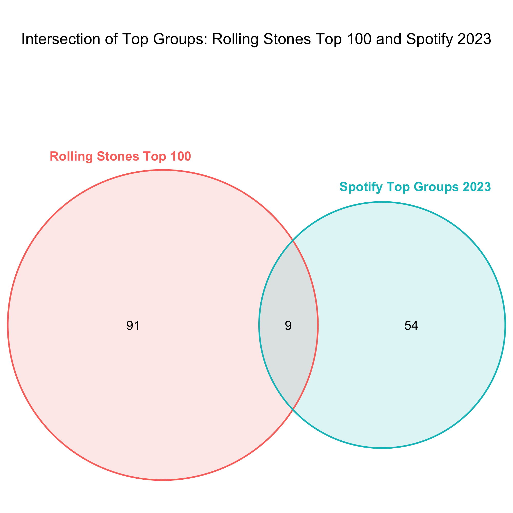

```{r setup, include=FALSE} 
#####################################
# SETUP
#####################################

knitr::opts_chunk$set(echo = FALSE) 

#####################################
# Install/load packages
#####################################

library(tidyverse)
library(RSelenium)
library(netstat)
library(DBI)
library(RSQLite)
library(purrr)
library(httr)
library(base64enc)
library(jsonlite)
library(rvest)
library(plotly)
library(VennDiagram)
library(grid)
library(png)
library(cowplot)
```


## GitHub

The GitHub repository for **this assignment** can be found [here](https://github.com/emmi3105/472_final).

## Task

### Research question:

"_Rolling Stone_ Magazine ranked their 100 greatest musical artists of all time. At the end of 2023, how has their music endured? Are there any features or characteristics that seem to explain enduring engagement? 

### Required data sources:

- [Rolling Stone's 100 Greatest Artists, 2010](https://www.rollingstone.com/music/music-lists/100-greatest-artists-147446/)

- [Spotify Web API](https://developer.spotify.com/documentation/web-api)


Ideas:

- Who were the articles written by/who did the rankings?
  - Men?
  - Older people?

- Potentially, nowadays, mostly the new generation decides what's popular on spotify
  - They want female artists
  - And shorter songs -> by newer artists ("TikTok" songs)
  
  
- Idea: plot the average duration of the most popular songs of the top 100 artists against the average duration of the songs in the top 50 global playlist

-> Nowadays, songs "go viral" on social media

3 fields of analysis to find out the endurement

1. Performance on spotify

2. Concerts/Events
  - Idea. Before attending an event/concert by a specifiy artist, the people who will attend might listen to their music much more
  
3. Social Media presence


Data:

- Rolling Stones top 100 artists
- Spotify API
  - Top 100 artist information
  - Top 100 tracks
  - Top tracks 2023 US
- Ticketmaster API
- Social Media data?


THESE: Die RS-T100 sind eher gefestigte Institutionen als artists, die gerade, im Jahr 2023, "viral" sind.

To DO:
- Delete event_df from the database
- Überarbeiten: data extraction for artists_fm_df (maybe just add popularity and followers to the top 100 df)
- Überarbeiten: in general data extraction Last FM
- Gleich weitermachen: Data Analysis: besser strukturieren, ordnen, schauen, welche grafiken es wirklich braucht

## 1. Introduction 

```{r create a relational database}

################################################################################
# Step 1: Create a relational database

# Create database
db <- dbConnect(RSQLite::SQLite(), "data/spotify.sqlite")

# Check existence of the database
print(file.exists("data/spotify.sqlite"))
```

```{r check_table function}

# Function that checks whether a table exists in the relational database
check_table <- function(db, a_table){
  
  # Check if the "a_table" exists
  if (a_table %in% dbListTables(db)) {
    
    # Get the row count
    query <- paste("SELECT COUNT(*) FROM", a_table)
    row_count <- dbGetQuery(db, query)[1, 1]
    
    # Get the column names
    column_names <- as.character(dbListFields(db, a_table))
    
    # Get the column count
    column_count <- length(unlist(column_names))
    
    # Print out dimensions and column names
    formatted_string <- sprintf("The table %s exists and has the following dimensions: \nNumber of rows: %s \nNumber of columns: %s", a_table, row_count, column_count)
    column_answer <- sprintf("Column names: %s", paste(column_names, collapse = ", "))
    
    return(cat(formatted_string, column_answer, sep = "\n"))
    
  } else {
    # If "a_table" does not exist, return this statement:
    return(cat("The table does not exist."))
  }
}
```


## 2. Data

### 2A. Rolling Stones Data (Table 1)

```{r get rolling stones data, eval=FALSE}

################################################################################
# Step 2: Get the data

################################################################################
# Step 2A: Rolling Stones data

# Launch the driver and browser
invisible(capture.output({
  rD <- rsDriver(browser=c("firefox"), port = free_port(random = TRUE), chromever = NULL) 
  driver <- rD$client
}))

# Navigate to the website
url <- "https://www.rollingstone.com/music/music-lists/100-greatest-artists-147446/"
driver$navigate(url)

# Reject the privacy policies
reject_button <- driver$findElement(using = "xpath", 
                                    value = '//*[@id="onetrust-reject-all-handler"]')
# Click on the button:
reject_button$clickElement()

# Create a data frame that will later hold the top 100 artists
top_hundred_artists_df <- data.frame(
  Artist_Name = character(0),
  Ranking = numeric(0),
  Article_Text = character(0),
  stringsAsFactors = FALSE
)

# Add 100 empty rows
top_hundred_artists_df <- top_hundred_artists_df[rep(NA, 100), ]

# Click the load more button
load_more <- function(){
  # Load more button
  load_more_button <- driver$findElement(using = "xpath", 
                                      value = '/html/body/div[5]/main/div[2]/div[1]/div/article/div[3]/div[2]/div[2]/a')
  # Click on the button:
  load_more_button$clickElement()
}

# Click the load previous button
load_previous <- function(){
  # Load more button
  load_previous_button <- driver$findElement(using = "xpath", 
                                         value = '/html/body/div[5]/main/div[2]/div[1]/div/article/div[3]/div[2]/div[1]')
  # Click on the button:
  load_previous_button$clickElement()
}

# Extract the rankings
extract_rank <- function(){
  # Find all elements with the class name "c-gallery-vertical-album__number"
  artist_rank_elements <- driver$findElements(using = "class name", value = "c-gallery-vertical-album__number")
  
  # Extract text from each element
  artist_ranks <- sapply(artist_rank_elements, function(element) element$getElementText()[[1]])
  
  # Print or use the extracted information
  return(artist_ranks)
}

# Extract the artist names
extract_artist_names <- function(){
  # Find all elements with the class name "c-gallery-vertical-album__title"
  artist_name_elements <- driver$findElements(using = "class name", value = "c-gallery-vertical-album__title")
  
  # Extract text from each element
  artist_names <- sapply(artist_name_elements, function(element) element$getElementText()[[1]])
  
  # Print or use the extracted information
  return(artist_names)
}

# Extract the article text
extract_article_text <- function(){
  # Find all elements with the class name "c-gallery-vertical-album__title"
  article_text_elements <- driver$findElements(using = "class name", value = "c-gallery-vertical-album__description")
  
  # Extract text for the first 50 elements
  article_text <- sapply(article_text_elements, function(element) element$getElementText()[[1]])
  
  # Print or use the extracted information
  return(article_text)
}

# Scrape the data
scrape_artist_rankings <- function(){
  # Assign values from the vector to the first 50 rows of the "Ranking" column in top_hundred_artists_df
  top_hundred_artists_df$Ranking[1:50] <- extract_rank()
  top_hundred_artists_df$Artist_Name[1:50] <- extract_artist_names()
  top_hundred_artists_df$Article_Text[1:50] <- extract_article_text()

  # Click the load more button
  load_more()
  Sys.sleep(2)

  # Assign values from the vector to the last 50 rows of the "Ranking" column in top_hundred_artists_df
  top_hundred_artists_df$Ranking[51:100] <- extract_rank()
  top_hundred_artists_df$Artist_Name[51:100] <- extract_artist_names()
  top_hundred_artists_df$Article_Text[51:100] <- extract_article_text()
  
  return(top_hundred_artists_df)
}

# Call the artist ranking web scraping function
top_hundred_artists_df <- scrape_artist_rankings()

# Save the data frame as a global variable
assign("top_hundred_artists_df", top_hundred_artists_df, envir = .GlobalEnv)

# Save the data frame as an RData file in the current working directory
save(top_hundred_artists_df, file = "data/top_hundred_artists_data.RData")
```


```{r load the Rolling Stones data}

# Load the data from the RData file
load("data/top_hundred_artists_data.RData")

# Make a copy of the data frame
top_hundred_artists <- data.frame(top_hundred_artists_df)
```


```{r close the RSelenium procsses, eval=FALSE}

# Close the RSelenium processes:
driver$close()
# Close the associated Java processes
system("taskkill /im java.exe /f", intern=FALSE, ignore.stdout=FALSE)
```


### 2B. Spotify API Data (Tables 1 - 5)

```{r get Spotify API data, eval=FALSE}
################################################################################
# Step 2B: Spotify API data

readRenviron("../../Documents/R_Environs/spotify_api.env")
client_id <- Sys.getenv("CLIENT_ID")
client_secret <- Sys.getenv("CLIENT_SECRET")

# Create a base64-encoded string of the client ID and client secret
credentials <- paste0(client_id, ':', client_secret)
base64_credentials <- base64enc::base64encode(charToRaw(credentials))

# Set up the authentication request
auth_response <- httr::POST(
  'https://accounts.spotify.com/api/token',
  add_headers(
    Authorization = paste0('Basic ', base64_credentials),
    'Content-Type' = 'application/x-www-form-urlencoded'
  ),
  body = list(grant_type = 'client_credentials'),
  encode = 'form'
)

# Check for HTTP errors
if (http_error(auth_response)) {
  print(status_code(auth_response))
  print(content(auth_response, "text"))
} else {
  # Extract the access token from the response
  access_token <- httr::content(auth_response)$access_token
}

# 1) Get the artist ID given the artist name 

get_artist_id <- function(artist_name) {
  # Define the Spotify API endpoint for searching an artist
  search_url <- 'https://api.spotify.com/v1/search'
  
  # Set up the request with the access token
  search_response <- GET(
    search_url,
    query = list(q = artist_name, type = 'artist'),
    add_headers(Authorization = paste0('Bearer ', access_token))
  )
  
  # Extract the artist ID from the response
  search_results <- content(search_response, "parsed")
  
  # Check if any results were returned
  if (length(search_results$artists$items) > 0) {
    artist_id <- search_results$artists$items[[1]]$id
    return(artist_id)
  } else {
    # Return NA or any other value to indicate no match
    return(NA)
  }
}

# Apply the function to the entire "Artist_Name" column in the data frame
top_hundred_artists$Spotify_Artist_ID <- sapply(top_hundred_artists$Artist_Name, get_artist_id)

# 2) Get the artist info given the artist ID 
get_artist_info <- function(artist_id){
  # Define the Spotify API endpoint for getting information about an artist
  artist_url <- paste0('https://api.spotify.com/v1/artists/', artist_id)
  
  # Set up the request with the access token
  artist_response <- GET(artist_url, add_headers(Authorization = paste0('Bearer ', access_token)))
  
  # Extract the artist information from the response
  artist_info <- content(artist_response)
  
  followers <- artist_info$followers$total[1]
  genres <- artist_info$genres[1]
  popularity <- artist_info$popularity
  
  # Create a list with the extracted information
  artist_data <- list(followers = followers, genres = genres, popularity = popularity)
  
  return(artist_data)
}

# Apply the function to the entire "Artist_Name" column in the data frame
result <- lapply(top_hundred_artists$Spotify_Artist_ID, get_artist_info)

# Extract individual elements
top_hundred_artists$Followers <- sapply(result, function(x) x$followers)
top_hundred_artists$Genres <- sapply(result, function(x) x$genres)
top_hundred_artists$Popularity <- sapply(result, function(x) x$popularity)


# Remove the row names
top_hundred_artists <- data.frame(top_hundred_artists, row.names = NULL)
# Transform the "Genres" column into type character 
top_hundred_artists$Genres <- sapply(top_hundred_artists$Genres, function(x) paste(x, collapse = ","))

# 3) Get the release date of the latest album

# Create an empty data frame for the top tracks
album_data <- data.frame(
  Spotify_Artist_ID = character(0),
  Artist_Name = character(0),
  Spotify_Album_ID = character(0),
  Album_Name = character(0),
  Album_Release_Date = character(0),
  Number_of_Tracks = numeric(0),
  stringsAsFactors = FALSE
)

get_album_data <- function(the_artist_id){
  
  album_url <- paste0('https://api.spotify.com/v1/artists/', the_artist_id, '/albums')
  # Set up the request with the access token
  album_response <- GET(album_url, 
                        add_headers(Authorization = paste0('Bearer ', access_token)))
  
  album_info <- content(album_response)
  
  return(album_info)
}

# Function that gets the album data given the artist ID and using the function get_album_data
get_albums <- function(the_artist_id) {
  
  # Get the data given the artist id
  albums <- get_album_data(the_artist_id)
  
  # Loop through the top tracks for each artist
  if (!is.null(albums$items) && length(albums$items) > 0) {
    # Enter the loop
    for (i in seq(length(albums$items))) {
  
      # Check and extract values, appending NA if a value is missing
      album_data <- rbind(album_data, data.frame(
        Spotify_Artist_ID = ifelse(!is.null(the_artist_id), the_artist_id, NA),
        Artist_Name = ifelse(!is.null(albums$items[[i]]$artists[[1]]$name), albums$items[[i]]$artists[[1]]$name, NA),
        Spotify_Album_ID = ifelse(!is.null(albums$items[[i]]$id), albums$items[[i]]$id, NA),
        Album_Name = ifelse(!is.null(albums$items[[i]]$name), albums$items[[i]]$name, NA),
        Album_Release_Date = ifelse(!is.null(albums$items[[i]]$release_date), albums$items[[i]]$release_date, NA),
        Number_of_Tracks = ifelse(!is.null(albums$items[[i]]$total_tracks), albums$items[[i]]$total_tracks, NA)
        ))
    }
  } else {
    album_data <- rbind(album_data, data.frame(
      Spotify_Artist_ID = the_artist_id,
      Artist_Name = NA,
      Spotify_Album_ID = NA,
      Album_Name = NA,
      Album_Release_Date = NA,
      Number_of_Tracks = NA))
  }
  
  return(album_data)
}

result_list <- lapply(top_hundred_artists$Spotify_Artist_ID, get_albums)
album_data <- do.call(rbind, result_list)


album_data <- album_data %>%
  mutate(
    is_full_date = grepl("\\d{4}-\\d{2}-\\d{2}", Album_Release_Date),
    Album_Release_Date = case_when(
      is_full_date ~ as.Date(Album_Release_Date, format = "%Y-%m-%d"),
      TRUE ~ as.Date(paste0(Album_Release_Date, "-01-01"), format = "%Y-%m-%d")
    )
  )

# Remove the temporary column
album_data$is_full_date <- NULL

# Group by Artist_ID and find the latest album release date
Latest_Album_Release <- album_data %>%
  group_by(Spotify_Artist_ID) %>%
  summarize(Latest_Album_Release = max(Album_Release_Date, na.rm = TRUE))

# Merge the result back into top_hundred_artists
top_hundred_artists <- merge(top_hundred_artists, Latest_Album_Release, by = "Spotify_Artist_ID", all.x = TRUE)

top_hundred_artists$Latest_Album_Release <- as.character(top_hundred_artists$Latest_Album_Release)
```

```{r get the artist top tracks, eval=FALSE}

# 4) Get the artist top tracks

# Create an empty data frame for the top tracks
top_tracks_data <- data.frame(
  Spotify_Artist_ID = character(0),
  Artist_Name = character(0),
  Spotify_Track_ID = character(0),
  Track_Name = character(0),
  Track_Popularity = numeric(0),
  Track_Duration = numeric(0),
  Album_Release_Date = character(0),
  stringsAsFactors = FALSE
)

# Function that queries the API for each artist's top track data given their ID
get_track_data <- function(the_artist_id, market="US") {
  # Define the Spotify API endpoint for getting an artist's top tracks
  top_tracks_url <- paste0('https://api.spotify.com/v1/artists/', the_artist_id, '/top-tracks?market=', market)
  
  # Set up the request with the access token
  top_tracks_response <- GET(
    top_tracks_url,
    add_headers(Authorization = paste0('Bearer ', access_token))
  )
  
  # Extract the top tracks from the response
  top_tracks <- content(top_tracks_response, "parsed")
  
  return(top_tracks)
}

# Function that gets further info on the top tracks given the artist ID and using the function get_track_data
get_top_tracks <- function(the_artist_id) {
  
  # Get the data given the artist ID
  top_tracks <- get_track_data(the_artist_id)
  
  # Loop through the top tracks for each artist
  if (!is.null(top_tracks$tracks) && length(top_tracks$tracks) > 0) {
    # Enter the loop
    for (i in seq(length(top_tracks$tracks))) {
      # Calculate Collaboration value for each song
      collaboration_value <- ifelse(length(top_tracks$tracks[[i]]$artists) > 1, 1, 0)
      
      # Check and extract values, appending NA if a value is missing
      top_tracks_data <- rbind(top_tracks_data, data.frame(
        Spotify_Artist_ID = ifelse(!is.null(top_tracks$tracks[[i]]$artists[[1]]$id), the_artist_id, NA),
        Artist_Name = ifelse(!is.null(top_tracks$tracks[[i]]$artists[[1]]$name), top_tracks$tracks[[i]]$artists[[1]]$name, NA),
        Spotify_Track_ID = ifelse(!is.null(top_tracks$tracks[[i]]$id), top_tracks$tracks[[i]]$id, NA),
        Track_Name = ifelse(!is.null(top_tracks$tracks[[i]]$name), top_tracks$tracks[[i]]$name, NA),
        Track_Popularity = ifelse(!is.null(top_tracks$tracks[[i]]$popularity), top_tracks$tracks[[i]]$popularity, NA),
        Track_Duration = ifelse(!is.null(top_tracks$tracks[[i]]$duration_ms), top_tracks$tracks[[i]]$duration_ms, NA),
        Album_Release_Date = ifelse(!is.null(top_tracks$tracks[[i]]$album$release_date), top_tracks$tracks[[i]]$album$release_date, NA),
        Collaboration = collaboration_value
      ))
    }
  } else {
    top_tracks_data <- rbind(top_tracks_data, data.frame(
      Spotify_Artist_ID = the_artist_id,
      Artist_Name = NA,
      Spotify_Track_ID = NA,
      Track_Name = NA,
      Track_Popularity = NA,
      Track_Duration = NA,
      Album_Release_Date = NA,
      Collaboration = NA
    ))
  }
  
  return(top_tracks_data)
}

result_list <- lapply(top_hundred_artists$Spotify_Artist_ID, get_top_tracks)
top_tracks_data <- do.call(rbind, result_list)

# Clean the top_tracks_data
top_tracks_data <- top_tracks_data %>%
  mutate(
    is_full_date = grepl("\\d{4}-\\d{2}-\\d{2}", Album_Release_Date),
    Album_Release_Date = case_when(
      is_full_date ~ as.Date(Album_Release_Date, format = "%Y-%m-%d"),
      TRUE ~ as.Date(paste0(Album_Release_Date, "-01-01"), format = "%Y-%m-%d")
    )
  )

# Remove the temporary column
top_tracks_data$is_full_date <- NULL

# Write top_tracks_data to the relational database
dbWriteTable(db, "top_tracks_df", top_tracks_data, overwrite = TRUE)
```


```{r call check_table on "top_tracks_df"}

# Call check_table on "top_tracks_df"
check_table(db, "top_tracks_df")
```

Getting the playlists:
Improve the code so that one set of functions can be used for any playlist

```{r get the spotify top tracks of 2023, eval=FALSE}

# 5) Get the Spotify playlist "Top Tracks of 2023, USA"

# Get a playlist
get_playlist <- function(playlist_id){
 
  # Spotify API endpoint for getting playlist details
  endpoint <- paste0('https://api.spotify.com/v1/playlists/', playlist_id)
  
  # Set up the request headers with the access token
  headers <- c('Authorization' = paste0('Bearer ', access_token))
  
  # Make the GET request
  playlist_response <- GET(endpoint, add_headers(headers))
  playlist_data <- content(playlist_response, 'parsed')
  
  return(playlist_data)
}

# Function that gets the playlist info given the playlist id
get_playlist_info <- function(playlist_id, a_dataframe) {
  
  # Get the playlist data given the playlist id
  dt <- get_playlist(playlist_id)
  
  # Loop to append values
  for (i in seq(length(dt$tracks$items))) {
    # Append the values to the dataframe
    a_dataframe <- rbind(a_dataframe, data.frame(Playlist_Name = dt$name,
                                                 Playlist_ID = dt$id,
                                                 Playlist_Description = dt$description,
                                                 Track_Name = dt$tracks$items[[i]]$track$name,
                                                 Artist_Name = dt$tracks$items[[i]]$track$artists[[1]]$name,
                                                 Spotify_Track_ID = dt$tracks$items[[i]]$track$id,
                                                 Track_Duration = dt$tracks$items[[i]]$track$duration_ms,
                                                 Track_Popularity = dt$tracks$items[[i]]$track$popularity,
                                                 Album_Release_Date = dt$tracks$items[[i]]$track$album$release_date
                                                 ))
  }
  
  # Return the resulting dataframe
  return(a_dataframe)
}

# Create an empty dataframe
top_tracks_2023_USA <- data.frame(
  Playlist_Name = character(0),
  Playlist_ID = character(0),
  Playlist_Description = character(0),
  Track_Name = character(0),
  Artist_Name = character(0),
  Spotify_Track_ID = character(0),
  Track_Duration = numeric(0),
  Track_Popularity = numeric(0),
  Album_Release_Date = character(0),
  stringsAsFactors = FALSE
)

# Execute the function
top_tracks_2023_USA_id <- "37i9dQZF1DXbJMiQ53rTyJ"
top_tracks_2023_USA <- get_playlist_info(top_tracks_2023_USA_id, top_tracks_2023_USA)

# Get the artist ID for each artist on the top tracks 2023 playlist
top_tracks_2023_USA$Spotify_Artist_ID <- NA

# Add the artist IDs
top_tracks_2023_USA$Spotify_Artist_ID <- lapply(top_tracks_2023_USA$Artist_Name, get_artist_id)
top_tracks_2023_USA$Spotify_Artist_ID <- as.character(top_tracks_2023_USA$Spotify_Artist_ID)

# Write top_tracks_2023_USA to the relational database
dbWriteTable(db, "top_tracks_2023_USA_df", top_tracks_2023_USA, overwrite = TRUE)
```


```{r call check_table on "top_tracks_2023_USA_df"}

# Call check_table on "top_tracks_2023_USA_df"
check_table(db, "top_tracks_2023_USA_df")
```

Explain why you only look at the US (link to the US-centrism of the Rolling Stones ranking)

```{r get the spotify top artists 2023 USA, eval=FALSE}

# 6) Get the Spotify playlist "Top Artists of 2023, USA"

# Create an empty dataframe
top_artists_2023_USA <- data.frame(
  Playlist_Name = character(0),
  Playlist_ID = character(0),
  Playlist_Description = character(0),
  Track_Name = character(0),
  Artist_Name = character(0),
  Spotify_Track_ID = character(0),
  Track_Duration = numeric(0),
  Track_Popularity = numeric(0),
  Album_Release_Date = character(0),
  stringsAsFactors = FALSE
)

# Get the Playlist Info
top_artists_USA_id <- "37i9dQZF1DX4dwwIoKH0j7"
top_artists_2023_USA <- get_playlist_info(top_artists_USA_id, top_artists_2023_USA)

# Create a dataframe for the artists on the Top Artists 2023 USA Playlist
top_artists_2023 <- data.frame(
  Artist_Name = top_artists_2023_USA$Artist_Name,
  stringsAsFactors = FALSE
)

# Get the artist ID
top_artists_2023$Spotify_Artist_ID <- lapply(top_artists_2023$Artist_Name, get_artist_id)

# Get Artist Info
result <- lapply(top_artists_2023$Spotify_Artist_ID, get_artist_info)

# Extract individual elements: Popularity and Followers
top_artists_2023$Followers <- sapply(result, function(x) x$followers)
top_artists_2023$Popularity <- sapply(result, function(x) x$popularity)

# Remove the row names
top_artists_2023 <- data.frame(top_artists_2023, row.names = NULL)

# Convert list columns to character
top_artists_2023$Spotify_Artist_ID <- as.character(top_artists_2023$Spotify_Artist_ID)

# Write top_artists_2023 to the relational database
dbWriteTable(db, "top_artists_2023_USA_df", top_artists_2023, overwrite = TRUE)
```


```{r call check_table on "top_artists_2023_USA_df"}

# Call check_table on "top_artists_2023_USA_df"
check_table(db, "top_artists_2023_USA_df")
```


```{r get the spotify top groups 2023 USA, eval=FALSE}

# 7) Get the Spotify playlist "Top Groups of 2023, USA"

top_groups_2023 <- data.frame(
  Playlist_Name = character(0),
  Playlist_ID = character(0),
  Playlist_Description = character(0),
  Track_Name = character(0),
  Artist_Name = character(0),
  Spotify_Track_ID = character(0),
  Track_Duration = numeric(0),
  Track_Popularity = numeric(0),
  Album_Release_Date = character(0),
  stringsAsFactors = FALSE
)

# Get the Playlist Info
top_groups_2023_id <- "37i9dQZF1DX6Q49slBRXI2"
top_groups_2023_dt <- get_playlist_info(top_groups_2023_id, top_groups_2023)

# Create a dataframe for the artists on the Top Groups 2023 USA Playlist
top_groups_2023 <- data.frame(
  Artist_Name = top_groups_2023_dt$Artist_Name,
  stringsAsFactors = FALSE
)

# Get the artist ID
top_groups_2023$Spotify_Artist_ID <- lapply(top_groups_2023$Artist_Name, get_artist_id)

# Get Artist Info
result <- lapply(top_groups_2023$Spotify_Artist_ID, get_artist_info)

# Extract individual elements: Popularity and Followers
top_groups_2023$Followers <- sapply(result, function(x) x$followers)
top_groups_2023$Popularity <- sapply(result, function(x) x$popularity)

# Remove the row names
top_groups_2023 <- data.frame(top_groups_2023, row.names = NULL)

# Convert list columns to character
top_groups_2023$Spotify_Artist_ID <- as.character(top_groups_2023$Spotify_Artist_ID)

# Write top_groups_2023 to the relational database
dbWriteTable(db, "top_groups_2023_df", top_groups_2023, overwrite = TRUE)
```


```{r call check_table on "top_groups_2023_df"}

# Call check_table on "top_groups_2023_df"
check_table(db, "top_groups_2023_df")
```

### 2C. RIAA Data (Tables 6 and 7)

RIAA does not allow webscraping: https://www.riaa.com/privacy-policy-and-terms-of-use/. Therefore, I used wikipedia as a source to scrape information on album awards. Be aware, that the wikipedia data might not reflect the actual data on RIAA perfectly.


```{r get RIAA Wikipedia data, eval=FALSE}

################################################################################
# Step 2C: RIAA Wikipedia Data

get_wikipedia_tables <- function(url){
  # Storing the URL's HTML code
  html_content <- read_html(url)
  
  # Extracting all tables in the document 
  tab <- html_table(html_content, fill = TRUE)
  
  return(tab)
}

url <- "https://en.wikipedia.org/wiki/List_of_highest-certified_music_artists_in_the_United_States"
tab <- get_wikipedia_tables(url)

certified_albums_data <- as_tibble(tab[[1]][, 1:5])
certified_singles_data <- as_tibble(tab[[2]][, 1:5])

# Save the tables as global variables
assign("certified_albums_data", certified_albums_data, envir = .GlobalEnv)
assign("certified_singles_data", certified_singles_data, envir = .GlobalEnv)

# Save the global variables to an RData files
save(certified_albums_df, file = "data/certified_albums_data.RData")
save(certified_singles_df, file = "data/certified_singles_data.RData")

# Load global variables
load("data/certified_albums_data.RData")
load("data/certified_singles_data.RData")

# Copy the scraped table to avoid modifying the original data
certified_albums <- certified_albums_data
certified_singles <- certified_singles_data


certified_albums <- certified_albums %>%
  rename(Artist_Name = Name) %>%
  mutate(Spotify_Artist_ID = ifelse(Artist_Name %in% top_hundred_artists$Artist_Name, 
                            top_hundred_artists$Spotify_Artist_ID[match(Artist_Name, top_hundred_artists$Artist_Name)], 
                            NA)) %>%
  mutate(Top_Hundred = ifelse(!is.na(Spotify_Artist_ID), 1, 0))

certified_singles <- certified_singles %>%
  rename(Artist_Name = Name) %>%
  mutate(Spotify_Artist_ID = ifelse(Artist_Name %in% top_hundred_artists$Artist_Name, 
                                    top_hundred_artists$Spotify_Artist_ID[match(Artist_Name, top_hundred_artists$Artist_Name)], 
                                    NA)) %>%
  mutate(Top_Hundred = ifelse(!is.na(Spotify_Artist_ID), 1, 0))


# Write certified_singles and certified_singles to the relational database
dbWriteTable(db, "certified_albums_df", certified_albums, overwrite = TRUE)
dbWriteTable(db, "certified_singles_df", certified_singles, overwrite = TRUE)
```


```{r call check_table on "certified_albums_df" and "certified_singles_df"}

# Call check_table on "certified_albums_df" and "certified_singles_df"
check_table(db, "certified_albums_df")
check_table(db, "certified_singles_df")
```

### 2D. LastFM API Data (Tables 8-10)

```{r getLastFM API Data, eval=FALSE}

################################################################################
# Step 2D: LastFM API Data

# Set up the API Key and endpoint
readRenviron("../../Documents/R_Environs/lastfm_api.env")
lastfm_apikey <- Sys.getenv("KEY")
lastfm_endpoint <- "http://ws.audioscrobbler.com/2.0/"

# Function that gets the chart data
get_charts <- function(a_method){
  # Set parameters for the request
  params <- list(
    method = a_method,
    api_key = lastfm_apikey,
    format = "json"
  )

  # Make the GET request
  response <- GET(lastfm_endpoint, query = params)
  content <- content(response, "parsed") 

  return(content)
}

# Define methods
method_artists = "chart.getTopArtists"
method_tracks = "chart.getTopTracks"

# Create empty dataframes
charts_artists_data <- data.frame(
  Artist_Name = character(0),
  Playcount = numeric(0),
  Listeners = numeric(0),
  stringsAsFactors = FALSE
)

charts_tracks_data <- data.frame(
  Artist_Name = character(0),
  Playcount = numeric(0),
  Listeners = numeric(0),
  stringsAsFactors = FALSE
)

get_charts_info_artists <- function(a_method, dt_frame) {
  
  # Get the playlist data given the playlist id
  dt <- get_charts(a_method)
  
  # Loop to append values
  for (i in seq(length(dt$artists$artist))) {
    # Append the values to the dataframe
    dt_frame <- rbind(dt_frame, data.frame(Artist_Name = dt$artists$artist[[i]]$name,
                                           Playcount = dt$artists$artist[[i]]$playcount,
                                           Listeners = dt$artists$artist[[i]]$listeners
    ))
  }
  
  # Return the resulting dataframe
  return(dt_frame)
}

get_charts_info_tracks <- function(a_method, dt_frame) {
  
  # Get the playlist data given the playlist id
  dt <- get_charts(a_method)
  
  # Loop to append values
  for (i in seq(length(dt$tracks$track))) {
    # Append the values to the dataframe
    dt_frame <- rbind(dt_frame, data.frame(Artist_Name = dt$tracks$track[[i]]$artist$name,
                                           Playcount = dt$tracks$track[[i]]$playcount,
                                           Listeners = dt$tracks$track[[i]]$listeners
    ))
  }
  
  # Return the resulting dataframe
  return(dt_frame)
}

charts_artists_data <- get_charts_info_artists(method_artists, charts_artists_data)
charts_tracks_data <- get_charts_info_tracks(method_tracks, charts_tracks_data)

# Format the data
charts_artists_data <- charts_artists_data %>%
  mutate(Spotify_Artist_ID = ifelse(Artist_Name %in% top_hundred_artists$Artist_Name, 
                                    top_hundred_artists$Spotify_Artist_ID[match(Artist_Name, top_hundred_artists$Artist_Name)], 
                                    NA),
         Top_Hundred = ifelse(!is.na(Spotify_Artist_ID), 1, 0),
         Playcount = as.numeric(Playcount),
         Listeners = as.numeric(Listeners)
         ) 

charts_tracks_data <- charts_tracks_data %>%
  mutate(Spotify_Artist_ID = ifelse(Artist_Name %in% top_hundred_artists$Artist_Name, 
                                    top_hundred_artists$Spotify_Artist_ID[match(Artist_Name, top_hundred_artists$Artist_Name)], 
                                    NA),
         Top_Hundred = ifelse(!is.na(Spotify_Artist_ID), 1, 0),
         Playcount = as.numeric(Playcount),
         Listeners = as.numeric(Listeners)
  ) 

# Write charts_artists_data and charts_tracks_data to the relational database
dbWriteTable(db, "charts_artists_df", charts_artists_data, overwrite = TRUE)
dbWriteTable(db, "charts_tracks_df", charts_tracks_data, overwrite = TRUE)
```


```{r call check_table on "charts_artists_df" and "charts_tracks_df"}

# Call check_table on "charts_artists_df" and "charts_tracks_df"
check_table(db, "charts_artists_df")
check_table(db, "charts_tracks_df")
```

Potentially: just add the playcount and listeners to the top 100 dataframe to make it more efficient?

```{r listeners and playcount for rs-t100, eval=FALSE}

# Table 10: Listeners and Playcount for RS-T100

# Create an empty dataframe
artists_fm_data <- data.frame(
  Artist_Name = character(0),
  Playcount = numeric(0),
  Listeners = numeric(0),
  On_Tour = numeric(0),
  stringsAsFactors = FALSE
)

get_artists_fm <- function(artist_name){
  # Set parameters for the request
  params <- list(
    method = "artist.getInfo",
    artist = artist_name,
    api_key = lastfm_apikey,
    format = "json"
  )
    # Make the GET request
  response <- GET(lastfm_endpoint, query = params)
  content <- content(response, "parsed") 
  
  return(content)
}

get_artist_info_fm <- function(artist_name) {
  
  # Get the playlist data given the playlist id
  dt <- get_artists_fm(artist_name)
  
  # Append the values of interest
  if (length(dt$artist) == 0) {
    # If no data is available, create a data frame with NAs
    artists_fm_data <- rbind(artists_fm_data, data.frame(Artist_Name = artist_name,
                                                         Playcount = NA,
                                                         Listeners = NA,
                                                         On_Tour = NA))
  } else {
    # If data is available, append the values of interest
    artists_fm_data <- rbind(artists_fm_data, data.frame(Artist_Name = artist_name,
                                                         Playcount = dt$artist$stats$playcount,
                                                         Listeners = dt$artist$stats$listeners,
                                                         On_Tour = dt$artist$ontour))
  }
  
  # Return the resulting dataframe
  return(artists_fm_data)
}

result_list <- lapply(top_hundred_artists$Artist_Name, get_artist_info_fm)
artists_fm_data <- do.call(rbind, result_list)

# Format the data
artists_fm_data <- artists_fm_data %>%
  mutate(Spotify_Artist_ID = ifelse(Artist_Name %in% top_hundred_artists$Artist_Name,
                                    top_hundred_artists$Spotify_Artist_ID[match(Artist_Name, top_hundred_artists$Artist_Name)], 
                                    NA),
         Playcount = as.numeric(Playcount),
         Listeners = as.numeric(Listeners)
         ) 

# Add the newly retrieved variables "Playcount", "Listeners" and "On_Tour" to top_hundred_artists

top_hundred_artists$Listeners_LastFM <- ifelse(top_hundred_artists$Spotify_Artist_ID %in%artists_fm_data$Spotify_Artist_ID, 
                                               artists_fm_data$Listeners[match(top_hundred_artists$Spotify_Artist_ID, artists_fm_data$Spotify_Artist_ID)], 
                                               NA)

top_hundred_artists$Playcount_LastFM <- ifelse(top_hundred_artists$Spotify_Artist_ID %in%artists_fm_data$Spotify_Artist_ID, 
                                               artists_fm_data$Playcount[match(top_hundred_artists$Spotify_Artist_ID, artists_fm_data$Spotify_Artist_ID)], 
                                               NA)

top_hundred_artists$On_Tour <- ifelse(top_hundred_artists$Spotify_Artist_ID %in%artists_fm_data$Spotify_Artist_ID,
                                      artists_fm_data$On_Tour[match(top_hundred_artists$Spotify_Artist_ID, artists_fm_data$Spotify_Artist_ID)], 
                                      NA)

# Write top_hundred_artists to the relational database
dbWriteTable(db, "top_hundred_artists_df", top_hundred_artists, overwrite = TRUE)
```


```{r call check_table on "top_hundred_artists_df"}

# Call check_table on "top_hundred_artists_df"
check_table(db, "top_hundred_artists_df")
```


```{r Last FM top tracks for RS-T100, eval=FALSE}

# Table 11: Last FM top tracks for each artist

# Create an empty dataframe
top_tracks_fm_data <- data.frame(
  Artist_Name = character(0),
  Track_Name = character(0),
  Track_Playcount = numeric(0),
  Track_Listeners = numeric(0),
  stringsAsFactors = FALSE
)

get_top_tracks_fm <- function(artist_name){
  # Set parameters for the request
  params <- list(
    method = "artist.getTopTracks",
    artist = artist_name,
    api_key = lastfm_apikey,
    format = "json"
  )
  
  # Make the GET request
  response <- GET(lastfm_endpoint, query = params)
  content <- content(response, "parsed") 
  
  return(content)
}

get_tracks_info_fm <- function(artist_name) {
  
  # Get the playlist data given the playlist id
  dt <- get_top_tracks_fm(artist_name)
  
  # Append the values of interest
  if (length(dt$toptracks$track) == 0) {
    # If no data is available, create a data frame with NAs
    top_tracks_fm_data <- rbind(top_tracks_fm_data, data.frame(Artist_Name = artist_name,
                                                               Track_Name = NA,
                                                               Track_Playcount = NA,
                                                               Track_Listeners = NA
                                                               ))
  } else {
    # If data is available, append the values of interest
    top_tracks_fm_data <- rbind(top_tracks_fm_data, data.frame(Artist_Name = artist_name,
                                                               Track_Name = dt$toptracks$track[[1]]$name,
                                                               Track_Playcount = dt$toptracks$track[[1]]$playcount,
                                                               Track_Listeners = dt$toptracks$track[[1]]$listeners
                                                               ))
  }
  
  # Return the resulting dataframe
  return(top_tracks_fm_data)
}

result_list <- lapply(top_hundred_artists$Artist_Name, get_tracks_info_fm)
top_tracks_fm_data <- do.call(rbind, result_list)

# Format the data
top_tracks_fm_data <- top_tracks_fm_data %>%
  mutate(Spotify_Artist_ID = ifelse(Artist_Name %in% top_hundred_artists$Artist_Name,
                                    top_hundred_artists$Spotify_Artist_ID[match(Artist_Name, top_hundred_artists$Artist_Name)], 
                                    NA),
         Track_Playcount = as.numeric(Track_Playcount),
         Track_Listeners = as.numeric(Track_Listeners)
  ) 

# Write top_tracks_fm_data to the relational database
dbWriteTable(db, "top_tracks_fm_df", top_tracks_fm_data, overwrite = TRUE)
```


```{r call check_table on "top_tracks_fm_df"}

# Call check_table on "top_tracks_fm_df"
check_table(db, "top_tracks_fm_df")
```


## 3. Analysis


### A. Are the Rolling Stones Top 100 still relevant in 2023?

We calculate an *Endurement Score* for the RS-T100 by dividing the following four variables by four: 

1. Spotify Popularity
2. Spotify Followers
3. Last FM Playcount
4. Last FM Listeners

We create a scale. Taylor Swift, as the artist with the most monthly listeners on Spotify will have the full score of 100%, a score of 0% is created when all of the variables are 0.^[As of 23. December 2023, Taylor Swift had 109'341'734 monthly listeners on Spotify.] 

#### On a scale of 1 to Taylor Swift ...?

```{r calculate endurement score, eval=FALSE}
endurement_score_query <-  "
  SELECT Spotify_Artist_ID, Followers, Popularity, Listeners_LastFM, Playcount_LastFM
  FROM top_hundred_artists_df 
  ;
"

# Execute the query
endurement_score_result <- dbGetQuery(db, endurement_score_query)

endurement_score_result <- endurement_score_result %>%
  mutate(Followers = ifelse(is.na(Followers), 1, Followers),
         Popularity = ifelse(0, 1, Popularity),
         Listeners_LastFM = ifelse(is.na(Listeners_LastFM), 1, Listeners_LastFM),
         Playcount_LastFM = ifelse(is.na(Playcount_LastFM), 1, Playcount_LastFM),
         Spotify_Endurement = as.numeric(Followers) * as.numeric(Popularity),
         LastFM_Endurement = as.numeric(Listeners_LastFM) * as.numeric(Playcount_LastFM))
  

# Taylor Swift Endurement Score
ts_data <- get_artist_info("06HL4z0CvFAxyc27GXpf02")
ts_followers <- as.numeric(ts_data$followers)
ts_popularity <- as.numeric(ts_data$popularity)

ts_fm_data <- get_artists_fm("Taylor Swift")
ts_listeners_fm <- as.numeric(ts_fm_data$artist$stats$listeners)
ts_playcount_fm <- as.numeric(ts_fm_data$artist$stats$playcount)

ts_spotify_endurement = ts_followers * ts_popularity 
ts_lastfm_endurement = ts_listeners_fm * ts_playcount_fm

endurement_score_result <- endurement_score_result %>%
  mutate(Spotify_Endurement = Spotify_Endurement/ts_spotify_endurement * 100,
         LastFM_Endurement = LastFM_Endurement/ts_lastfm_endurement * 100)

endurement_score_result <- endurement_score_result %>%
  mutate(LastFM_Endurement = as.numeric(format(LastFM_Endurement, scientific = FALSE)))

# Save the data frame as a global variable
assign("endurement_score_result", endurement_score_result, envir = .GlobalEnv)

# Save the data frame as an RData file in the current working directory
save(endurement_score_result, file = "data/endurement_score_result.RData")
```


```{r plot endurement score}

# Load the data from the RData file
load("data/endurement_score_result.RData")

# Make a copy of the data frame
endurement_score_data <- data.frame(endurement_score_result)

# Plot the endurement scores (on a scale of 1 to Taylor Swift)
endurement_plot <- ggplot(endurement_score_data,
                          aes(x = Spotify_Endurement, y = LastFM_Endurement)) +
  geom_point(size = 1, color = "#F8766D") +
  geom_point(aes(x = 100, y = 100), color = "#00BA38", size = 3, fill = "#00BA38", shape = 23) +
  # Add labels
  geom_text(aes(x = 25, y = 30, label = "RS-T100"), size = 3, family = "Arial", color = "#F8766D") +
  geom_text(aes(x = 100, y = 100, label = "Taylor Swift"), vjust = 2, hjust = 1, size = 3, family = "Arial", color = "#00BA38") +
  # Add titles
  labs(title = "Spotify Endurement vs. Last FM Endurement",
       x = "Spotify Endurement",
       y = "LastFM Endurement"
       ) +
  theme_minimal() +
  # Adjust the font size for the title and the axes
  theme(
    axis.text = element_text(size = 8),     
    axis.title = element_text(size = 8),    
    plot.title = element_text(size = 12)
    )

    
endurement_plot
```


More precisely, we will compare the distributions of these four variables between the RS-T100 and (A) the most streamed artists on Spotify and (B) the most streamed artists on Last FM.

AND THEN INTERSECTIONS????


### B. What explains endurement?

-> potentially the four variables are all positively correlated 

#### Spotify - Popularity and Followers

#### Charts - Listeners and Playcount (double plot tracks and artists)

-> hence, we need to look somewhere else for the explanation

#### Track Popularity vs. Endurement (Spotify)

#### Artists Popularity/Followers vs. Latest Album Release (Spotify) (double plot)

#### RIAA Certifications (RIAA Ranking vs. Popularity and Followers)

#### Tour: Last FM 

**Question**: Is the playcount/listeners higher for artists that are on tour?


### C. Intersections


### D. Critique

- Most of the artists are men (percentage)
- Most of the artists are from the US
- Most of the artists are (relatively) old


#### Popularity: Rolling Stones vs. Spotify Top 100

```{r plot 1 (Rolling Stones vs. Spotify top 100), warning=FALSE}

# Create an analysis table with the data we are interested in 

# 1. Column: Artist name
# 2. Column: Artist ID
# 4. Column: Followers
# 5. Column: Popularity

first_query_top100 <- "
  SELECT Artist_Name, Spotify_Artist_ID, Followers, Popularity
  FROM top_hundred_artists_df;
"

first_query_top23 <- "
  SELECT Artist_Name, Spotify_Artist_ID, Followers, Popularity
  FROM top_artists_2023_USA_df;
"

# Execute the query
first_result_top100 <- dbGetQuery(db, first_query_top100)
first_result_top23 <- dbGetQuery(db, first_query_top23)

# Add indicators
first_result_top100 <- first_result_top100 %>%
  mutate(Artist_Type = "Rolling Stones Top 100") %>%
  mutate(Followers = as.numeric(Followers)) %>%
  mutate(Popularity = as.numeric(Popularity))

first_result_top23 <- first_result_top23 %>%
  mutate(Artist_Type = "Spotify Top Artists 2023") %>%
  mutate(Followers = as.numeric(Followers)) %>%
  mutate(Popularity = as.numeric(Popularity))

first_result <- rbind(first_result_top100, first_result_top23)

# Calculate means
mean_followers_top100 <- mean(first_result_top100$Followers)
mean_followers_top23 <- mean(first_result_top23$Followers)

mean_popularity_top100 <- mean(first_result_top100$Popularity)
mean_popularity_top23 <- mean(first_result_top23$Popularity)

manual_colors <- c("Rolling Stones Top 100" = "#F8766D", "Spotify Top Artists 2023" = "#00BFC4")

# First Plot: Popularity vs followers 
first_plot <- ggplot(first_result, 
                     aes(y = Popularity, x = Followers, color = factor(Artist_Type))) +
  geom_point(size = 1) +
  # Add means
  geom_point(aes(x = mean_followers_top100, y = mean_popularity_top100), color = "#F8766D", size = 3, fill = "#F8766D", shape = 23) +
  geom_point(aes(x = mean_followers_top23, y = mean_popularity_top23), color = "#00BFC4", size = 3, fill = "#00BFC4", shape = 23) +
  geom_vline(xintercept = mean_followers_top100, linetype = "dotted", color = "#F8766D") +
  geom_hline(yintercept = mean_popularity_top100, linetype = "dotted", color = "#F8766D") +
  geom_vline(xintercept = mean_followers_top23, linetype = "dotted", color = "#00BFC4") +
  geom_hline(yintercept = mean_popularity_top23, linetype = "dotted", color = "#00BFC4") +
  # Add titles
  labs(title = "Followers vs. Popularity by Artist Type",
       x = "Spotify Followers",
       y = "Spotify Popularity",
       color = "Artist Type",
       shape = "Mean") +
  theme_minimal() +
  # Adjust the font size for the title and the axes
  theme(
    axis.text = element_text(size = 8),     
    axis.title = element_text(size = 8),    
    plot.title = element_text(size = 12)
  ) +
  # Use a logarithmic scale for the x-axis
  scale_x_continuous(
    labels = scales::comma_format(scale = 1),
    trans = 'log10'
  ) +
  scale_y_continuous(
    trans = 'log10'
  )+
  # Manually set colors for Artist_Type
  scale_color_manual(values = manual_colors)

# Convert ggplot to interactive plotly plot
first_plot_plotly <- ggplotly(first_plot) %>%
  layout(font = list(family = "Arial"))

# Display the interactive plot
first_plot_plotly
```

#### Tracks: Rolling Stones vs. Spotify Top 100 

```{r plot 2 (Rolling Stones vs. Spotify top 100 Tracks), warning=FALSE}

# 1B: Second plot: top 100 ranking top tracks vs. top tracks 2023

# Create an analysis table with the data we are interested in 

# 1. Column: Track_Name
# 2. Column: Track_ID
# 4. Column: Track_Popularity
# 5. Column: Track_Duration
# 6. Column: Artist_Name
# 7. Column: Artist_Type

# Note: We only use the very first artist that is listed as the song artist and neglect the other artists that collaborated on the track

second_query_top100 <- "
  SELECT Artist_Name, Spotify_Artist_ID, Track_Name, Spotify_Track_ID, Track_Popularity, Track_Duration
  FROM top_tracks_df;
"

second_query_top23 <- "
  SELECT Artist_Name, Spotify_Artist_ID, Track_Name, Spotify_Track_ID, Track_Popularity, Track_Duration
  FROM top_tracks_2023_USA_df;
"

# Execute the query
second_result_top100 <- dbGetQuery(db, second_query_top100)
second_result_top23 <- dbGetQuery(db, second_query_top23)

# Add indicators
second_result_top100 <- second_result_top100 %>%
  mutate(Track_Type = "Top Tracks of the Rolling Stones Top 100") %>%
  filter(complete.cases(.)) %>%
  group_by(Spotify_Artist_ID) %>%
  slice_max(Track_Popularity) %>%
  ungroup()

second_result_top23 <- second_result_top23 %>%
  mutate(Track_Type = "Spotify Top Tracks 2023") %>%
  filter(complete.cases(.))

second_result <- rbind(second_result_top100, second_result_top23)

second_result <- second_result


# Calculate means
mean_duration_top100 <- mean(second_result_top100$Track_Duration)
mean_duration_top23 <- mean(second_result_top23$Track_Duration)

mean_track_popularity_top100 <- mean(second_result_top100$Track_Popularity)
mean_track_popularity_top23 <- mean(second_result_top23$Track_Popularity)

manual_colors <- c("Top Tracks of the Rolling Stones Top 100" = "#F8766D", 
                   "Spotify Top Tracks 2023" = "#00BFC4")

# Second Plot: Popularity vs followers 
second_plot <- ggplot(second_result, 
                     aes(x = Track_Duration, y = Track_Popularity, color = factor(Track_Type))) +
  geom_point(size = 1) +
  # Add means
  geom_point(aes(x = mean_duration_top100, y = mean_track_popularity_top100), color = "#F8766D", size = 3, fill = "#F8766D", shape = 23) +
  geom_point(aes(x = mean_duration_top23, y = mean_track_popularity_top23), color = "#00BFC4", size = 3, fill = "#00BFC4", shape = 23) +
  geom_vline(xintercept = mean_duration_top100, linetype = "dotted", color = "#F8766D") +
  geom_hline(yintercept = mean_track_popularity_top100, linetype = "dotted", color = "#F8766D") +
  geom_vline(xintercept = mean_duration_top23, linetype = "dotted", color = "#00BFC4") +
  geom_hline(yintercept = mean_track_popularity_top23, linetype = "dotted", color = "#00BFC4") +
  # Add titles
  labs(title = "Track Popularity vs. Track Duration by Track Type",
       x = "Track Duration (in ms)",
       y = "Spotify Track Popularity",
       color = "Track Type",
       shape = "Mean") +
  theme_minimal() +
  # Adjust the font size for the title and the axes
  theme(
    axis.text = element_text(size = 8),     
    axis.title = element_text(size = 8),    
    plot.title = element_text(size = 12)
  ) +
  # Use a logarithmic scale for the x-axis
  scale_x_continuous(
    labels = scales::comma_format(scale = 1),
    trans = 'log10'
  ) +
  scale_y_continuous(
    trans = 'log10'
  )+
  # Manually set colors for Track_Type
  scale_color_manual(values = manual_colors)

# Convert ggplot to interactive plotly plot
second_plot_plotly <- ggplotly(second_plot) %>%
  layout(font = list(family = "Arial"))

# Display the interactive plot
second_plot_plotly
```

In general, there is some level of endurement. The Rolling Stones Top 100 can almost hold up with the most listened artists in 2023 on Spotify.

#### Intersections: Rolling Stones vs. Spotify Top 100

```{r venn diagrams, eval=FALSE}
# First venn diagram: Rolling Stones Top 100 & Spotify Top Artists of 2023

set1 <- first_result %>% filter(Artist_Type=="Rolling Stones Top 100") %>% select(Spotify_Artist_ID) %>% unlist()
set2 <- first_result %>% filter(Artist_Type=="Spotify Top Artists 2023") %>% select(Spotify_Artist_ID) %>% unlist()

# Make the plot
venn <- venn.diagram(
  x = list(set1, set2),
  category.names = c("Rolling Stones Top 100" , "Spotify Top Artists 2023"),
  filename = 'venn_diagramm.png',
  output=TRUE,
  col=c('#F8766D', '#00BFC4'),
  fill = c(alpha('#F8766D',0.3), alpha('#00BFC4',0.3)),
  fontfamily = "arial",
  # Output festures
  imagetype="png",
  height = 2000 , 
  width = 2000 , 
  resolution = 300,
  # Adjust the set names
  cat.pos = c(-14, 14),
  cat.cex = 1, 
  cat.col = c('#F8766D', '#00BFC4'),
  cat.fontface = "bold",
  cat.fontfamily = "arial",
  # Add a title
  main = "Intersection of Rolling Stones Top 100 and Spotify Top Artists 2023",
  main.cex = 1.2,
  main.fontfamily = "arial" 
)

# Second venn diagram: Rolling Stones Top Tracks & Spotify Top Tracks of 2023

third_query_top100 <- "
  SELECT Artist_Name, Spotify_Artist_ID, Track_Name, Spotify_Track_ID
  FROM top_tracks_df;
"

third_query_top23 <- "
  SELECT Artist_Name, Spotify_Artist_ID, Track_Name, Spotify_Track_ID
  FROM top_tracks_2023_USA_df;
"

# Execute the query
third_result_top100 <- dbGetQuery(db, third_query_top100)
third_result_top23 <- dbGetQuery(db, third_query_top23)

# Add indicators
third_result_top100 <- third_result_top100 %>%
  mutate(Track_Type = "Top Tracks of the Rolling Stones Top 100") %>%
  filter(complete.cases(.))

third_result_top23 <- third_result_top23 %>%
  mutate(Track_Type = "Spotify Top Tracks 2023") %>%
  filter(complete.cases(.))

third_result <- rbind(third_result_top100, third_result_top23)

set3 <- third_result %>% filter(Track_Type=="Top Tracks of the Rolling Stones Top 100") %>% select(Spotify_Track_ID) %>% unlist()
set4 <- third_result %>% filter(Track_Type=="Spotify Top Tracks 2023") %>% select(Spotify_Track_ID) %>% unlist() 

# Make the plot
venn_tracks <- venn.diagram(
  x = list(set3, set4),
  category.names = c("Top Tracks of the Rolling Stones Top 100" , "Spotify Top Tracks 2023"),
  filename = 'venn_diagramm_tracks.png',
  output=TRUE,
  col=c('#F8766D', '#00BFC4'),
  fill = c(alpha('#F8766D',0.3), alpha('#00BFC4',0.3)),
  fontfamily = "arial",
  # Output festures
  imagetype="png",
  height = 2000 , 
  width = 2000 , 
  resolution = 300,
  # Adjust the set names
  cat.pos = c(-14, 13.5),
  cat.cex = 1, 
  cat.col = c('#F8766D', '#00BFC4'),
  cat.fontface = "bold",
  cat.fontfamily = "arial",
  # Add a title
  main = "Intersection of Top Tracks: Rolling Stones Top 100 and Spotify 2023",
  main.cex = 1.2,
  main.fontfamily = "arial" 
)
```


```{r third venn diagram groups get data}

# Third venn diagram: Rolling Stones Top 100 & Spotify Top Groups of 2023

fourth_query_top23 <- "
  SELECT Artist_Name, Spotify_Artist_ID, Followers, Popularity
  FROM top_groups_2023_df;
"

# Execute the query
fourth_result_top23 <- dbGetQuery(db, fourth_query_top23)

# Add indicators
fourth_result_top23 <- fourth_result_top23 %>%
  mutate(Artist_Type = "Spotify Top Groups 2023") %>%
  filter(complete.cases(.))

fourth_result <- rbind(first_result_top100, fourth_result_top23)

set5 <- fourth_result %>% filter(Artist_Type=="Rolling Stones Top 100") %>% select(Spotify_Artist_ID) %>% unlist()
set6 <- fourth_result %>% filter(Artist_Type=="Spotify Top Groups 2023") %>% select(Spotify_Artist_ID) %>% unlist()
```


```{r third venn diagram groups, eval=FALSE}
# Make the plot (eval = FALSE in RMarkdown)
venn_groups <- venn.diagram(
  x = list(set5, set6),
  category.names = c("Rolling Stones Top 100" , "Spotify Top Groups 2023"),
  filename = 'venn_diagramm_groups.png',
  output=TRUE,
  col=c('#F8766D', '#00BFC4'),
  fill = c(alpha('#F8766D',0.3), alpha('#00BFC4',0.3)),
  fontfamily = "arial",
  # Output festures
  imagetype="png",
  height = 2000 , 
  width = 2000 , 
  resolution = 300,
  # Adjust the set names
  cat.pos = c(-14, 13.5),
  cat.cex = 1, 
  cat.col = c('#F8766D', '#00BFC4'),
  cat.fontface = "bold",
  cat.fontfamily = "arial",
  # Add a title
  main = "Intersection of Top Groups: Rolling Stones Top 100 and Spotify 2023",
  main.cex = 1.2,
  main.fontfamily = "arial" 
)
```


```{r display the venn diagrams, echo=FALSE,out.width="30%", out.height="30%",fig.cap="caption",fig.show='hold',fig.align='center'}

# Display the venn diagrams
img1 <- knitr::include_graphics("venn_diagramm.png")
img2 <- 
img3 <- knitr::include_graphics("venn_diagramm_tracks.png")

knitr::include_graphics(c(img1, img2, img3))
```

NOTE: In the first diagram, we used to have 80 Spotify Top Artists of 2023. Now we only have 62 -> nochmal prüfen


**Findings**: Although the Rolling Stones top 100 have, on average, high values for Followers and Popularity on Spotify, they seem to not quite be on the same level as the most popular artists of 2023.

**Questions**: Within the Rolling Stones top 100, can we sort out some patterns? Are some of these artists more popular nowadays than others, and if so, why?


**Findings**: Only ten of the hundred Rolling Stones artists appear in the Spotify top artists/groups of 2023. 

**Questions**: What makes these musicians different from the others?

#### Charts - Intersection

```{r prepare the charts data}

seventh_query_artists <- "
  SELECT Spotify_Artist_ID, Playcount, Listeners, Top_Hundred
  FROM charts_artists_df 
  ;
"

seventh_query_tracks <- "
  SELECT Spotify_Artist_ID, Playcount, Listeners, Top_Hundred
  FROM charts_tracks_df 
  ;
"

# Execute the query
seventh_result_artists <- dbGetQuery(db, seventh_query_artists)
seventh_result_tracks <- dbGetQuery(db, seventh_query_tracks)


# Add indicators
seventh_result_artists <- seventh_result_artists %>%
  mutate("Chart_Type" = "Artists",
         Listeners = as.numeric(Listeners),
         Playcount = as.numeric(Playcount))

seventh_result_tracks <- seventh_result_tracks %>%
  mutate("Chart_Type" = "Tracks",
         Listeners = as.numeric(Listeners),
         Playcount = as.numeric(Playcount))

seventh_result <- rbind(seventh_result_artists, seventh_result_tracks)

seventh_result$Spotify_Artist_ID <- ifelse(is.na(seventh_result$Spotify_Artist_ID), 
                                         paste0("index", seq_along(seventh_result$Spotify_Artist_ID)), 
                                         seventh_result$Spotify_Artist_ID)
```


```{r display the venn diagrams for lastfm charts, echo=FALSE,out.width="45%", out.height="45%",fig.cap="caption",fig.show='hold',fig.align='center'}

# Display the venn diagrams
img6 <- 
img7 <- 

knitr::include_graphics(c(img6, img7))
```

#### Charts - Listeners and Playcount

```{r plot the playcount vs. listeners for the charts data}

# B. Playcount vs. Listeners: Last FM charts vs. RS-T100

# Artists
# Calculate means
mean_playcount_top100_artists <- mean(seventh_result_artists$Playcount[seventh_result_artists$Top_Hundred == 1])
mean_playcount_charts_artists <- mean(seventh_result_artists$Playcount[seventh_result_artists$Top_Hundred == 0])

mean_listeners_top100_artists <- mean(seventh_result_artists$Listeners[seventh_result_artists$Top_Hundred == 1])
mean_listeners_charts_artists <- mean(seventh_result_artists$Listeners[seventh_result_artists$Top_Hundred == 0])

# Set manual colours
manual_colors_artists <- c("0" = "#619CFF", "1" = "#F8766D")
manual_labels <- c("0" = "Only LastFM Charts", "1" = "Also RS-T100")

# Plot: Playcount vs. Listeners
seventh_plot_artists <- ggplot(seventh_result_artists,
                               aes(x = Playcount, y = Listeners, color = factor(Top_Hundred))) +
  geom_point(size = 1) +
  # Add means
  geom_point(aes(x = mean_playcount_top100_artists, y = mean_listeners_top100_artists), color = "#F8766D", size = 3, fill = "#F8766D", shape = 23) +
  geom_point(aes(x = mean_playcount_charts_artists, y = mean_listeners_charts_artists), color = "#619CFF", size = 3, fill = "#619CFF", shape = 23) +
  geom_vline(xintercept = mean_playcount_top100_artists, linetype = "dotted", color = "#F8766D") +
  geom_hline(yintercept = mean_listeners_top100_artists, linetype = "dotted", color = "#F8766D") +
  geom_vline(xintercept = mean_playcount_charts_artists, linetype = "dotted", color = "#619CFF") +
  geom_hline(yintercept = mean_listeners_charts_artists, linetype = "dotted", color = "#619CFF") +
  # Add titles
  labs(title = "Artists Playcount vs. Listeners: Last FM charts vs. RS-T100",
       x = "Last FM Playcount",
       y = "Last FM Listeners",
       color = "RS-T100") +
  theme_minimal() +
  # Adjust the font size for the title and the axes
  theme(
    axis.text = element_text(size = 8),     
    axis.title = element_text(size = 8),    
    plot.title = element_text(size = 12)
  ) +
  # Use a logarithmic scale for the x-axis
  scale_x_continuous(
    labels = scales::comma_format(scale = 1),
    trans = 'log10'
  ) +
  scale_y_continuous(
    labels = scales::comma_format(scale = 1),
    trans = 'log10'
  ) +
  # Manually set colors for Artist_Type
  scale_color_manual(values = manual_colors_artists, labels = manual_labels)

# Tracks
# Calculate means
mean_playcount_top100_tracks <- mean(seventh_result_tracks$Playcount[seventh_result_tracks$Top_Hundred == 1])
mean_playcount_charts_tracks <- mean(seventh_result_tracks$Playcount[seventh_result_tracks$Top_Hundred == 0])

mean_listeners_top100_tracks <- mean(seventh_result_tracks$Listeners[seventh_result_tracks$Top_Hundred == 1])
mean_listeners_charts_tracks <- mean(seventh_result_tracks$Listeners[seventh_result_tracks$Top_Hundred == 0])

# Set manual colours
manual_colors_tracks <- c("0" = "#EBAC23", "1" = "#F8766D")

# Plot: Playcount vs. Listeners
seventh_plot_tracks <- ggplot(seventh_result_tracks,
                               aes(x = Playcount, y = Listeners, color = factor(Top_Hundred))) +
  geom_point(size = 1) +
  # Add means
  geom_point(aes(x = mean_playcount_top100_tracks, y = mean_listeners_top100_tracks), color = "#F8766D", size = 3, fill = "#F8766D", shape = 23) +
  geom_point(aes(x = mean_playcount_charts_tracks, y = mean_listeners_charts_tracks), color = "#EBAC23", size = 3, fill = "#EBAC23", shape = 23) +
  geom_vline(xintercept = mean_playcount_top100_tracks, linetype = "dotted", color = "#F8766D") +
  geom_hline(yintercept = mean_listeners_top100_tracks, linetype = "dotted", color = "#F8766D") +
  geom_vline(xintercept = mean_playcount_charts_tracks, linetype = "dotted", color = "#EBAC23") +
  geom_hline(yintercept = mean_listeners_charts_tracks, linetype = "dotted", color = "#EBAC23") +
  # Add titles
  labs(title = "Tracks Playcount vs. Listeners: Last FM charts vs. RS-T100",
       x = "Last FM Playcount",
       y = "Last FM Listeners",
       color = "RS-T100") +
  theme_minimal() +
  # Adjust the font size for the title and the axes
  theme(
    axis.text = element_text(size = 8),     
    axis.title = element_text(size = 8),    
    plot.title = element_text(size = 12)
  ) +
  # Use a logarithmic scale for the x-axis
  scale_x_continuous(
    labels = scales::comma_format(scale = 1),
    trans = 'log10'
  ) +
  scale_y_continuous(
    labels = scales::comma_format(scale = 1),
    trans = 'log10'
  ) +
  # Manually set colors for Artist_Type
  scale_color_manual(values = manual_colors_tracks, labels = manual_labels)

# Arrange the two plots vertically
seventh_plot <- plot_grid(seventh_plot_artists, seventh_plot_tracks, ncol = 1)

# Display the combined plot
seventh_plot
```


### B. Why are some of the Rolling Stones Top 100 in the Spotify top artists of 2023, and others are not?

IDEA 1: Album/Song releases
Potentially, the artists that keep releasing new songs/albums still endure compared to artists who do not release new music or are potentially even split up/passed away


#### Latest Album Release Date

Potentially, the artists that keep releasng new songs/albums remain more relevant compared to the artists who have not released new songs in a while.

```{r plot 3 (album release dates), warning=FALSE}

# Plot 3: Latest album release dates

fifth_query_top100 <- "
  SELECT Artist_Name, Spotify_Artist_ID, Followers, Popularity, FORMAT(Latest_Album_Release, 'yyyy-MM-dd') as Latest_Album_Release
  FROM top_hundred_artists_df;
"

# Execute the query
fifth_result_top100 <- dbGetQuery(db, fifth_query_top100)

fifth_result_top100$Top_Group_23 <- as.integer(fifth_result_top100$Spotify_Artist_ID %in% fourth_result_top23$Spotify_Artist_ID)
fifth_result_top100$Top_Artist_23 <- as.integer(fifth_result_top100$Spotify_Artist_ID %in% first_result_top23$Spotify_Artist_ID)

fifth_result_top100 <- fifth_result_top100 %>%
  mutate(Top_23 = Top_Group_23 + Top_Artist_23) %>%
  select(-Top_Group_23, -Top_Artist_23) %>%
  mutate(Latest_Album_Release = as.Date(Latest_Album_Release, format = "%Y-%m-%d"))


manual_colors <- c("0" = "#F8766D", "1" = "#00BFC4")
manual_labels <- c("0" = "Only Rolling Stones Top 100", "1" = "Also Spotify Top Artist/Group 2023")

# Plot A: Popularity vs Latest album release date 
fifth_plot_popularity <- ggplot(fifth_result_top100, 
                     aes(x = Latest_Album_Release, y = Popularity, color = factor(Top_23))) +
  geom_point(size = 1) +
  # Add titles
  labs(title = "Latest Album Release Date vs. Popularity",
       x = "Latest Album Release Date",
       y = "Spotify Popularity",
       color = "Ranking Appearance") +
  theme_minimal() +
  # Adjust the font size for the title and the axes
  theme(
    axis.text = element_text(size = 8),     
    axis.title = element_text(size = 8),    
    plot.title = element_text(size = 12)
  ) +
  # Manually set colors for Artist_Type
  scale_color_manual(values = manual_colors, labels = manual_labels)

# Plot B: Followers vs Latest album release date 
fifth_plot_followers <- ggplot(fifth_result_top100, 
                     aes(x = Latest_Album_Release, y = Followers, color = factor(Top_23))) +
  geom_point(size = 1) +
  # Add titles
  labs(title = "Latest Album Release Date vs. Followers",
       x = "Latest Album Release Date",
       y = "Spotify Followers",
       color = "Ranking Appearance") +
  theme_minimal() +
  # Adjust the font size for the title and the axes
  theme(
    axis.text = element_text(size = 8),     
    axis.title = element_text(size = 8),    
    plot.title = element_text(size = 12)
  ) +
  # Manually set colors for Artist_Type
  scale_color_manual(values = manual_colors, labels = manual_labels) +
  scale_y_continuous(
    labels = scales::comma_format(scale = 1)
    #trans = 'log10'
  ) 

# Arrange the two plots vertically
fifth_plot <- plot_grid(fifth_plot_popularity, fifth_plot_followers, ncol = 1)

# Display the combined plot
fifth_plot
```


OR: How many albums have they released in the past 10 years

#### On tour???

Use the data from last fm api


### RESULTS
Seemingly, there might be three factors that induce endurement
1. new releases which might push
2. popularity
3. followers
4. endurement 

-> Henneh-Ei problem: from this simple analysis, we cannot conclude which of these factors induces the other, we would need a more thorough analysis using statistical tools (e.g., regression) and tests

### C. Additional Analysis: RIAA

If neither the Spotify streams, nor the popularity, nor the followers seem to be the (only) factors that decide over the Rolling Stones Top 100 Ranking, what could determine that Ranking?

#### Intersection of RIAA Certifications and Rolling Stones Top 100

```{r venn diagram: RIAA certification and Rolling Stones top 100, eval=FALSE}

# 3A: Intersections RIAA most ranked and Rolling Stones Top 100

sixth_query_albums <- "
  SELECT Spotify_Artist_ID, Rank AS RIAA_Rank, Top_Hundred
  FROM certified_albums_df 
  ;
"

sixth_query_singles <- "
  SELECT Spotify_Artist_ID, Rank AS RIAA_Rank, Top_Hundred
  FROM certified_singles_df 
  ;
"

# Execute the query
sixth_result_albums <- dbGetQuery(db, sixth_query_albums)
sixth_result_singles <- dbGetQuery(db, sixth_query_singles)


# Add indicators
sixth_result_albums <- sixth_result_albums %>%
  mutate("RIAA_Ranking_Type" = "Albums")

sixth_result_singles <- sixth_result_singles %>%
  mutate("RIAA_Ranking_Type" = "Singles")

sixth_result <- rbind(sixth_result_albums, sixth_result_singles)

sixth_result$Spotify_Artist_ID <- ifelse(is.na(sixth_result$Spotify_Artist_ID), 
                                         paste0("index", seq_along(sixth_result$Spotify_Artist_ID)), 
                                         sixth_result$Spotify_Artist_ID)

# Create sets for the venn diagrams
set7 <- sixth_result %>% filter(RIAA_Ranking_Type=="Albums") %>% select(Spotify_Artist_ID) %>% unlist()
set8 <- sixth_result %>% filter(RIAA_Ranking_Type=="Singles") %>% select(Spotify_Artist_ID) %>% unlist() 
set9 <- first_result_top100 %>% select(Spotify_Artist_ID) %>% unlist() 


# Make the plots (eval = FALSE in RMarkdown)
venn_riaa_albums <- venn.diagram(
  x = list(set9, set7),
  category.names = c("Rolling Stones Top 100" , "Top 100 most RIAA certified albums"),
  filename = 'venn_diagramm_riaa_albums.png',
  output=TRUE,
  col=c('#F8766D', '#F564E3'),
  fill = c(alpha('#F8766D',0.3), alpha('#F564E3',0.3)),
  fontfamily = "arial",
  # Output festures
  imagetype="png",
  height = 4000 , 
  width = 4000 , 
  resolution = 300,
  # Adjust the set names
  cat.pos = c(-14, 13.5),
  cat.cex = 1, 
  cat.col = c('#F8766D', '#F564E3'),
  cat.fontface = "bold",
  cat.fontfamily = "arial",
  # Add a title
  main = "Intersection of Rolling Stones Top 100 and Top 100 most RIAA certified albums",
  main.cex = 1.2,
  main.fontfamily = "arial" 
)

venn_riaa_singles <- venn.diagram(
  x = list(set9, set8),
  category.names = c("Rolling Stones Top 100" , "Top 100 most RIAA certified singles"),
  filename = 'venn_diagramm_riaa_singles.png',
  output=TRUE,
  col=c('#F8766D', '#00BA38'),
  fill = c(alpha('#F8766D',0.3), alpha('#00BA38',0.3)),
  fontfamily = "arial",
  # Output festures
  imagetype="png",
  height = 4000 , 
  width = 4000 , 
  resolution = 300,
  # Adjust the set names
  cat.pos = c(-14, 13.5),
  cat.cex = 1, 
  cat.col = c('#F8766D', '#00BA38'),
  cat.fontface = "bold",
  cat.fontfamily = "arial",
  # Add a title
  main = "Intersection of Rolling Stones Top 100 and Top 100 most RIAA certified singles",
  main.cex = 1.2,
  main.fontfamily = "arial" 
)
```


```{r display the venn diagrams for RIAA rankings, echo=FALSE,out.width="45%", out.height="45%",fig.cap="caption",fig.show='hold',fig.align='center'}

# Display the venn diagrams
img4 <- knitr::include_graphics("venn_diagramm_riaa_albums.png")
img5 <- 

knitr::include_graphics(c(img4, img5))
```


#### RIAA Rankings vs. Rolling Stones Rankings

```{r Plot: RIAA Rankings vs. Rolling Stones Rankings}

# Plot 5: RIAA certifications 

sixth_query_albums <- "
  SELECT Spotify_Artist_ID, Rank AS RIAA_Rank, Top_Hundred
  FROM certified_albums_df 
  ;
"

sixth_query_singles <- "
  SELECT Spotify_Artist_ID, Rank AS RIAA_Rank, Top_Hundred
  FROM certified_singles_df 
  ;
"

sixth_query_top100 <- "
  SELECT Spotify_Artist_ID, Ranking AS Rolling_Stones_Rank
  FROM top_hundred_artists_df 
  ;
"

# Execute the query
sixth_result_albums <- dbGetQuery(db, sixth_query_albums)
sixth_result_singles <- dbGetQuery(db, sixth_query_singles)
sixth_result_top100 <- dbGetQuery(db, sixth_query_top100)


# Filter only for the top 100
sixth_result_albums <- sixth_result_albums %>%
  filter(Top_Hundred == 1)  %>%
  left_join(sixth_result_top100, by = "Spotify_Artist_ID") %>%
  mutate("RIAA_Ranking_Type" = "Albums") %>%
  select(-Top_Hundred) 

sixth_result_singles <- sixth_result_singles %>%
  filter(Top_Hundred == 1)  %>%
  left_join(sixth_result_top100, by = "Spotify_Artist_ID") %>%
  mutate("RIAA_Ranking_Type" = "Singles") %>%
  select(-Top_Hundred) 

sixth_result <- rbind(sixth_result_albums, sixth_result_singles)

sixth_result <- sixth_result %>%
  mutate("Rolling_Stones_Rank" = as.numeric(Rolling_Stones_Rank),
         "RIAA_Rank" = as.numeric(RIAA_Rank)
         )

manual_colors <- c("Albums" = "#F564E3", 
                   "Singles" = "#00BA38")

# Plot: Top 100 Ranking vs RIAA certification
sixth_plot <- ggplot(sixth_result,
                     aes(x = Rolling_Stones_Rank, y = RIAA_Rank, color = factor(RIAA_Ranking_Type))) +
  geom_point(size = 1) +
  # Add titles
  labs(title = "Rolling Stones vs. RIAA Rankings",
       x = "Rolling Stones Ranking",
       y = "RIAA Ranking",
       color = "RIAA Ranking Type") +
  theme_minimal() +
  # Adjust the font size for the title and the axes
  theme(
    axis.text = element_text(size = 8),     
    axis.title = element_text(size = 8),    
    plot.title = element_text(size = 12)
  ) +
  # Manually set colors for Artist_Type
  scale_color_manual(values = manual_colors, labels = manual_labels)

# Convert ggplot to interactive plotly plot
sixth_plot_plotly <- ggplotly(sixth_plot) %>%
  layout(font = list(family = "Arial"))

# Display the interactive plot
sixth_plot_plotly
```


#### Critique

-> Potentially, the Rolling Stones Top 100 artists of all times is also due to personal preference: 

"The essays on these top 100 artists are by their peers: singers, producers and musicians. In these fan testimonials, indie rockers pay tribute to world-beating rappers (Vampire Weekend’s Ezra Koenig on Jay-Z), young pop stars honor stylistic godmothers (Britney Spears on Madonna) and Billy Joel admits that Elton John “kicks my ass on piano." (https://www.rollingstone.com/music/music-lists/100-greatest-artists-147446/)

-> The articles were mostly written by men (percentage) from the US (percentage). It is not surprising, therefore, that the lineup shows a large neglection of female and/or non-American artists.

-> Potentially, these factors also explain why the endurement for the Rolling Stones Top 100 is not as big. Nowadays, the listeners simply demand more diversity and inclusion from musicians

The greatest artists of all time? Well, more like "A list of 100 mostly male, mostly American, probably quite famous artists that were a thing in the past".


#### Limitations

- no access to social media data -> especially TikTok is a driving force nowadays, when it comes to what songs go "viral" and what artists are en vogue
- webscraping is not allowed for many websites (e.g., it would have been interesting to get the monthly listeners value for the rolling stones top 100, or whether they are ranked and if so how, but spotify does not allow webscraping)

## Data

## Code Sources

## Appendix: All code in this assignment

```{r close the database connection}

# Close the database connection
dbDisconnect(db)
```


```{r ref.label=knitr::all_labels(), echo=TRUE, eval=FALSE} 


```  
