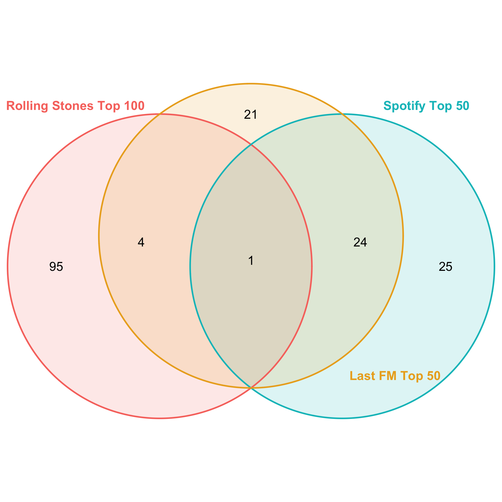

```{r setup, include=FALSE} 
#####################################
# SETUP
#####################################

knitr::opts_chunk$set(echo = FALSE) 

#####################################
# Install/load packages
#####################################

library(tidyverse)
library(RSelenium)
library(netstat)
library(DBI)
library(RSQLite)
library(purrr)
library(httr)
library(base64enc)
library(jsonlite)
library(rvest)
library(plotly)
library(VennDiagram)
library(grid)
library(png)
library(cowplot)
```


## GitHub

The GitHub repository for **this assignment** can be found [here](https://github.com/emmi3105/472_final).

## Task

### Research question:

"_Rolling Stone_ Magazine ranked their 100 greatest musical artists of all time. At the end of 2023, how has their music endured? Are there any features or characteristics that seem to explain enduring engagement? 

### Required data sources:

- [Rolling Stone's 100 Greatest Artists, 2010](https://www.rollingstone.com/music/music-lists/100-greatest-artists-147446/)

- [Spotify Web API](https://developer.spotify.com/documentation/web-api)


Ideas:

- Who were the articles written by/who did the rankings?
  - Men?
  - Older people?

- Potentially, nowadays, mostly the new generation decides what's popular on spotify
  - They want female artists
  - And shorter songs -> by newer artists ("TikTok" songs)
  
  
- Idea: plot the average duration of the most popular songs of the top 100 artists against the average duration of the songs in the top 50 global playlist

-> Nowadays, songs "go viral" on social media

3 fields of analysis to find out the endurance

1. Performance on spotify

2. Concerts/Events
  - Idea. Before attending an event/concert by a specifiy artist, the people who will attend might listen to their music much more
  
3. Social Media presence


Data:

- Rolling Stones top 100 artists
- Spotify API
  - Top 100 artist information
  - Top 100 tracks
  - Top tracks 2023 US
- Ticketmaster API
- Social Media data?


THESE: Die RS-T100 sind eher gefestigte Institutionen als artists, die gerade, im Jahr 2023, "viral" sind.

To DO:
- Delete event_df from the database
- Überarbeiten: data extraction for artists_fm_df (maybe just add popularity and followers to the top 100 df)
- Überarbeiten: in general data extraction Last FM
- Gleich weitermachen: Data Analysis: besser strukturieren, ordnen, schauen, welche grafiken es wirklich braucht


+++ Parliament Funkadelic: andere Spotify ID: 6XswoC68grx55in1WQnJ7E"

## 1. Introduction 

```{r create a relational database}

################################################################################
# Step 1: Create a relational database

# Create database
db <- dbConnect(RSQLite::SQLite(), "data/spotify.sqlite")

# Check existence of the database
print(file.exists("data/spotify.sqlite"))
```

```{r check_table function}

# Function that checks whether a table exists in the relational database
check_table <- function(db, a_table){
  
  # Check if the "a_table" exists
  if (a_table %in% dbListTables(db)) {
    
    # Get the row count
    query <- paste("SELECT COUNT(*) FROM", a_table)
    row_count <- dbGetQuery(db, query)[1, 1]
    
    # Get the column names
    column_names <- as.character(dbListFields(db, a_table))
    
    # Get the column count
    column_count <- length(unlist(column_names))
    
    # Print out dimensions and column names
    formatted_string <- sprintf("The table %s exists and has the following dimensions: \nNumber of rows: %s \nNumber of columns: %s", a_table, row_count, column_count)
    column_answer <- sprintf("Column names: %s", paste(column_names, collapse = ", "))
    
    return(cat(formatted_string, column_answer, sep = "\n"))
    
  } else {
    # If "a_table" does not exist, return this statement:
    return(cat("The table does not exist."))
  }
}
```


## 2. Data

### 2A. Rolling Stones Data (Table 1)

```{r get rolling stones data, eval=FALSE}

################################################################################
# Step 2: Get the data

################################################################################
# Step 2A: Rolling Stones data

# Launch the driver and browser
invisible(capture.output({
  rD <- rsDriver(browser=c("firefox"), port = free_port(random = TRUE), chromever = NULL) 
  driver <- rD$client
}))

# Navigate to the website
url <- "https://www.rollingstone.com/music/music-lists/100-greatest-artists-147446/"
driver$navigate(url)

# Reject the privacy policies
reject_button <- driver$findElement(using = "xpath", 
                                    value = '//*[@id="onetrust-reject-all-handler"]')
# Click on the button:
reject_button$clickElement()

# Create a data frame that will later hold the top 100 artists
top_hundred_artists_df <- data.frame(
  Artist_Name = character(0),
  Ranking = numeric(0),
  Article_Text = character(0),
  stringsAsFactors = FALSE
)

# Add 100 empty rows
top_hundred_artists_df <- top_hundred_artists_df[rep(NA, 100), ]

# Click the load more button
load_more <- function(){
  # Load more button
  load_more_button <- driver$findElement(using = "xpath", 
                                      value = '/html/body/div[5]/main/div[2]/div[1]/div/article/div[3]/div[2]/div[2]/a')
  # Click on the button:
  load_more_button$clickElement()
}

# Click the load previous button
load_previous <- function(){
  # Load more button
  load_previous_button <- driver$findElement(using = "xpath", 
                                         value = '/html/body/div[5]/main/div[2]/div[1]/div/article/div[3]/div[2]/div[1]')
  # Click on the button:
  load_previous_button$clickElement()
}

# Extract the rankings
extract_rank <- function(){
  # Find all elements with the class name "c-gallery-vertical-album__number"
  artist_rank_elements <- driver$findElements(using = "class name", value = "c-gallery-vertical-album__number")
  
  # Extract text from each element
  artist_ranks <- sapply(artist_rank_elements, function(element) element$getElementText()[[1]])
  
  # Print or use the extracted information
  return(artist_ranks)
}

# Extract the artist names
extract_artist_names <- function(){
  # Find all elements with the class name "c-gallery-vertical-album__title"
  artist_name_elements <- driver$findElements(using = "class name", value = "c-gallery-vertical-album__title")
  
  # Extract text from each element
  artist_names <- sapply(artist_name_elements, function(element) element$getElementText()[[1]])
  
  # Print or use the extracted information
  return(artist_names)
}

# Extract the article text
extract_article_text <- function(){
  # Find all elements with the class name "c-gallery-vertical-album__title"
  article_text_elements <- driver$findElements(using = "class name", value = "c-gallery-vertical-album__description")
  
  # Extract text for the first 50 elements
  article_text <- sapply(article_text_elements, function(element) element$getElementText()[[1]])
  
  # Print or use the extracted information
  return(article_text)
}

# Scrape the data
scrape_artist_rankings <- function(){
  # Assign values from the vector to the first 50 rows of the "Ranking" column in top_hundred_artists_df
  top_hundred_artists_df$Ranking[1:50] <- extract_rank()
  top_hundred_artists_df$Artist_Name[1:50] <- extract_artist_names()
  top_hundred_artists_df$Article_Text[1:50] <- extract_article_text()

  # Click the load more button
  load_more()
  Sys.sleep(2)

  # Assign values from the vector to the last 50 rows of the "Ranking" column in top_hundred_artists_df
  top_hundred_artists_df$Ranking[51:100] <- extract_rank()
  top_hundred_artists_df$Artist_Name[51:100] <- extract_artist_names()
  top_hundred_artists_df$Article_Text[51:100] <- extract_article_text()
  
  return(top_hundred_artists_df)
}

# Call the artist ranking web scraping function
top_hundred_artists_df <- scrape_artist_rankings()

# Save the data frame as a global variable
assign("top_hundred_artists_df", top_hundred_artists_df, envir = .GlobalEnv)

# Save the data frame as an RData file in the current working directory
save(top_hundred_artists_df, file = "data/top_hundred_artists_data.RData")
```


```{r load the Rolling Stones data}

# Load the data from the RData file
load("data/top_hundred_artists_data.RData")

# Make a copy of the data frame
top_hundred_artists <- data.frame(top_hundred_artists_df)
```


```{r close the RSelenium procsses, eval=FALSE}

# Close the RSelenium processes:
driver$close()
# Close the associated Java processes
system("taskkill /im java.exe /f", intern=FALSE, ignore.stdout=FALSE)
```


### 2B. Spotify API Data (Tables 1 - 5)

```{r get Spotify API data, eval=FALSE}
################################################################################
# Step 2B: Spotify API data

readRenviron("../../Documents/R_Environs/spotify_api.env")
client_id <- Sys.getenv("CLIENT_ID")
client_secret <- Sys.getenv("CLIENT_SECRET")

# Create a base64-encoded string of the client ID and client secret
credentials <- paste0(client_id, ':', client_secret)
base64_credentials <- base64enc::base64encode(charToRaw(credentials))

# Set up the authentication request
auth_response <- httr::POST(
  'https://accounts.spotify.com/api/token',
  add_headers(
    Authorization = paste0('Basic ', base64_credentials),
    'Content-Type' = 'application/x-www-form-urlencoded'
  ),
  body = list(grant_type = 'client_credentials'),
  encode = 'form'
)

# Check for HTTP errors
if (http_error(auth_response)) {
  print(status_code(auth_response))
  print(content(auth_response, "text"))
} else {
  # Extract the access token from the response
  access_token <- httr::content(auth_response)$access_token
}

# 1) Get the artist ID given the artist name 

get_artist_id <- function(artist_name) {
  # Define the Spotify API endpoint for searching an artist
  search_url <- 'https://api.spotify.com/v1/search'
  
  # Set up the request with the access token
  search_response <- GET(
    search_url,
    query = list(q = artist_name, type = 'artist'),
    add_headers(Authorization = paste0('Bearer ', access_token))
  )
  
  # Extract the artist ID from the response
  search_results <- content(search_response, "parsed")
  
  # Check if any results were returned
  if (length(search_results$artists$items) > 0) {
    artist_id <- search_results$artists$items[[1]]$id
    return(artist_id)
  } else {
    # Return NA or any other value to indicate no match
    return(NA)
  }
}

# Apply the function to the entire "Artist_Name" column in the data frame
top_hundred_artists$Spotify_Artist_ID <- sapply(top_hundred_artists$Artist_Name, get_artist_id)

# Replace the ID for Parliament and Funcadelic: 6XswoC68grx55in1WQnJ7E
top_hundred_artists <- top_hundred_artists %>%
  mutate(Spotify_Artist_ID = ifelse(Artist_Name == "Parliament and Funkadelic", "6XswoC68grx55in1WQnJ7E", Spotify_Artist_ID))

# 2) Get the artist info given the artist ID 
get_artist_info <- function(artist_id){
  # Define the Spotify API endpoint for getting information about an artist
  artist_url <- paste0('https://api.spotify.com/v1/artists/', artist_id)
  
  # Set up the request with the access token
  artist_response <- GET(artist_url, add_headers(Authorization = paste0('Bearer ', access_token)))
  
  # Extract the artist information from the response
  artist_info <- content(artist_response)
  
  followers <- artist_info$followers$total[1]
  genres <- artist_info$genres[1]
  popularity <- artist_info$popularity
  
  # Create a list with the extracted information
  artist_data <- list(followers = followers, genres = genres, popularity = popularity)
  
  return(artist_data)
}

# Apply the function to the entire "Artist_Name" column in the data frame
result <- lapply(top_hundred_artists$Spotify_Artist_ID, get_artist_info)

# Extract individual elements
top_hundred_artists$Followers <- sapply(result, function(x) x$followers)
top_hundred_artists$Genres <- sapply(result, function(x) x$genres)
top_hundred_artists$Popularity <- sapply(result, function(x) x$popularity)


# Remove the row names
top_hundred_artists <- data.frame(top_hundred_artists, row.names = NULL)
# Transform the "Genres" column into type character 
top_hundred_artists$Genres <- sapply(top_hundred_artists$Genres, function(x) paste(x, collapse = ","))

# 3) Get the release date of the latest album

# Create an empty data frame for the top tracks
album_data <- data.frame(
  Spotify_Artist_ID = character(0),
  Artist_Name = character(0),
  Spotify_Album_ID = character(0),
  Album_Name = character(0),
  Album_Release_Date = character(0),
  Number_of_Tracks = numeric(0),
  stringsAsFactors = FALSE
)

get_album_data <- function(the_artist_id){
  
  album_url <- paste0('https://api.spotify.com/v1/artists/', the_artist_id, '/albums')
  # Set up the request with the access token
  album_response <- GET(album_url, 
                        add_headers(Authorization = paste0('Bearer ', access_token)))
  
  album_info <- content(album_response)
  
  return(album_info)
}

# Function that gets the album data given the artist ID and using the function get_album_data
get_albums <- function(the_artist_id) {
  
  # Get the data given the artist id
  albums <- get_album_data(the_artist_id)
  
  # Loop through the top tracks for each artist
  if (!is.null(albums$items) && length(albums$items) > 0) {
    # Enter the loop
    for (i in seq(length(albums$items))) {
  
      # Check and extract values, appending NA if a value is missing
      album_data <- rbind(album_data, data.frame(
        Spotify_Artist_ID = ifelse(!is.null(the_artist_id), the_artist_id, NA),
        Artist_Name = ifelse(!is.null(albums$items[[i]]$artists[[1]]$name), albums$items[[i]]$artists[[1]]$name, NA),
        Spotify_Album_ID = ifelse(!is.null(albums$items[[i]]$id), albums$items[[i]]$id, NA),
        Album_Name = ifelse(!is.null(albums$items[[i]]$name), albums$items[[i]]$name, NA),
        Album_Release_Date = ifelse(!is.null(albums$items[[i]]$release_date), albums$items[[i]]$release_date, NA),
        Number_of_Tracks = ifelse(!is.null(albums$items[[i]]$total_tracks), albums$items[[i]]$total_tracks, NA)
        ))
    }
  } else {
    album_data <- rbind(album_data, data.frame(
      Spotify_Artist_ID = the_artist_id,
      Artist_Name = NA,
      Spotify_Album_ID = NA,
      Album_Name = NA,
      Album_Release_Date = NA,
      Number_of_Tracks = NA))
  }
  
  return(album_data)
}

result_list <- lapply(top_hundred_artists$Spotify_Artist_ID, get_albums)
album_data <- do.call(rbind, result_list)


album_data <- album_data %>%
  mutate(
    is_full_date = grepl("\\d{4}-\\d{2}-\\d{2}", Album_Release_Date),
    Album_Release_Date = case_when(
      is_full_date ~ as.Date(Album_Release_Date, format = "%Y-%m-%d"),
      TRUE ~ as.Date(paste0(Album_Release_Date, "-01-01"), format = "%Y-%m-%d")
    )
  )

# Remove the temporary column
album_data$is_full_date <- NULL

# Group by Artist_ID and find the latest album release date
Latest_Album_Release <- album_data %>%
  group_by(Spotify_Artist_ID) %>%
  summarize(Latest_Album_Release = max(Album_Release_Date, na.rm = TRUE))

# Merge the result back into top_hundred_artists
top_hundred_artists <- merge(top_hundred_artists, Latest_Album_Release, by = "Spotify_Artist_ID", all.x = TRUE)

top_hundred_artists$Latest_Album_Release <- as.character(top_hundred_artists$Latest_Album_Release)
```

```{r get the artist top tracks, eval=FALSE}

# 4) Get the artist top tracks

# Create an empty data frame for the top tracks
top_tracks_data <- data.frame(
  Spotify_Artist_ID = character(0),
  Artist_Name = character(0),
  Spotify_Track_ID = character(0),
  Track_Name = character(0),
  Track_Popularity = numeric(0),
  Track_Duration = numeric(0),
  Album_Release_Date = character(0),
  stringsAsFactors = FALSE
)

# Function that queries the API for each artist's top track data given their ID
get_track_data <- function(the_artist_id, market="US") {
  # Define the Spotify API endpoint for getting an artist's top tracks
  top_tracks_url <- paste0('https://api.spotify.com/v1/artists/', the_artist_id, '/top-tracks?market=', market)
  
  # Set up the request with the access token
  top_tracks_response <- GET(
    top_tracks_url,
    add_headers(Authorization = paste0('Bearer ', access_token))
  )
  
  # Extract the top tracks from the response
  top_tracks <- content(top_tracks_response, "parsed")
  
  return(top_tracks)
}

# Function that gets further info on the top tracks given the artist ID and using the function get_track_data
get_top_tracks <- function(the_artist_id) {
  
  # Get the data given the artist ID
  top_tracks <- get_track_data(the_artist_id)
  
  # Loop through the top tracks for each artist
  if (!is.null(top_tracks$tracks) && length(top_tracks$tracks) > 0) {
    # Enter the loop
    for (i in seq(length(top_tracks$tracks))) {
      # Calculate Collaboration value for each song
      collaboration_value <- ifelse(length(top_tracks$tracks[[i]]$artists) > 1, 1, 0)
      
      # Check and extract values, appending NA if a value is missing
      top_tracks_data <- rbind(top_tracks_data, data.frame(
        Spotify_Artist_ID = ifelse(!is.null(top_tracks$tracks[[i]]$artists[[1]]$id), the_artist_id, NA),
        Artist_Name = ifelse(!is.null(top_tracks$tracks[[i]]$artists[[1]]$name), top_tracks$tracks[[i]]$artists[[1]]$name, NA),
        Spotify_Track_ID = ifelse(!is.null(top_tracks$tracks[[i]]$id), top_tracks$tracks[[i]]$id, NA),
        Track_Name = ifelse(!is.null(top_tracks$tracks[[i]]$name), top_tracks$tracks[[i]]$name, NA),
        Track_Popularity = ifelse(!is.null(top_tracks$tracks[[i]]$popularity), top_tracks$tracks[[i]]$popularity, NA),
        Track_Duration = ifelse(!is.null(top_tracks$tracks[[i]]$duration_ms), top_tracks$tracks[[i]]$duration_ms, NA),
        Album_Release_Date = ifelse(!is.null(top_tracks$tracks[[i]]$album$release_date), top_tracks$tracks[[i]]$album$release_date, NA),
        Collaboration = collaboration_value
      ))
    }
  } else {
    top_tracks_data <- rbind(top_tracks_data, data.frame(
      Spotify_Artist_ID = the_artist_id,
      Artist_Name = NA,
      Spotify_Track_ID = NA,
      Track_Name = NA,
      Track_Popularity = NA,
      Track_Duration = NA,
      Album_Release_Date = NA,
      Collaboration = NA
    ))
  }
  
  return(top_tracks_data)
}

result_list <- lapply(top_hundred_artists$Spotify_Artist_ID, get_top_tracks)
top_tracks_data <- do.call(rbind, result_list)

# Clean the top_tracks_data
top_tracks_data <- top_tracks_data %>%
  mutate(
    is_full_date = grepl("\\d{4}-\\d{2}-\\d{2}", Album_Release_Date),
    Album_Release_Date = case_when(
      is_full_date ~ as.Date(Album_Release_Date, format = "%Y-%m-%d"),
      TRUE ~ as.Date(paste0(Album_Release_Date, "-01-01"), format = "%Y-%m-%d")
    )
  )

# Remove the temporary column
top_tracks_data$is_full_date <- NULL

# Write top_tracks_data to the relational database
dbWriteTable(db, "top_tracks_df", top_tracks_data, overwrite = TRUE)
```


```{r call check_table on "top_tracks_df"}

# Call check_table on "top_tracks_df"
check_table(db, "top_tracks_df")
```

Getting the playlists:
Improve the code so that one set of functions can be used for any playlist

```{r get the spotify top tracks of 2023, eval=FALSE}

# 5) Get the Spotify playlist "Top Tracks of 2023, USA"

# Get a playlist
get_playlist <- function(playlist_id){
 
  # Spotify API endpoint for getting playlist details
  endpoint <- paste0('https://api.spotify.com/v1/playlists/', playlist_id)
  
  # Set up the request headers with the access token
  headers <- c('Authorization' = paste0('Bearer ', access_token))
  
  # Make the GET request
  playlist_response <- GET(endpoint, add_headers(headers))
  playlist_data <- content(playlist_response, 'parsed')
  
  return(playlist_data)
}

# Function that gets the playlist info given the playlist id
get_playlist_info <- function(playlist_id, a_dataframe) {
  
  # Get the playlist data given the playlist id
  dt <- get_playlist(playlist_id)
  
  # Loop to append values
  for (i in seq(length(dt$tracks$items))) {
    # Append the values to the dataframe
    a_dataframe <- rbind(a_dataframe, data.frame(Playlist_Name = dt$name,
                                                 Playlist_ID = dt$id,
                                                 Playlist_Description = dt$description,
                                                 Track_Name = dt$tracks$items[[i]]$track$name,
                                                 Artist_Name = dt$tracks$items[[i]]$track$artists[[1]]$name,
                                                 Spotify_Track_ID = dt$tracks$items[[i]]$track$id,
                                                 Track_Duration = dt$tracks$items[[i]]$track$duration_ms,
                                                 Track_Popularity = dt$tracks$items[[i]]$track$popularity,
                                                 Album_Release_Date = dt$tracks$items[[i]]$track$album$release_date
                                                 ))
  }
  
  # Return the resulting dataframe
  return(a_dataframe)
}

# Create an empty dataframe
top_tracks_2023_USA <- data.frame(
  Playlist_Name = character(0),
  Playlist_ID = character(0),
  Playlist_Description = character(0),
  Track_Name = character(0),
  Artist_Name = character(0),
  Spotify_Track_ID = character(0),
  Track_Duration = numeric(0),
  Track_Popularity = numeric(0),
  Album_Release_Date = character(0),
  stringsAsFactors = FALSE
)

# Execute the function
top_tracks_2023_USA_id <- "37i9dQZF1DXbJMiQ53rTyJ"
top_tracks_2023_USA <- get_playlist_info(top_tracks_2023_USA_id, top_tracks_2023_USA)

# Get the artist ID for each artist on the top tracks 2023 playlist
top_tracks_2023_USA$Spotify_Artist_ID <- NA

# Add the artist IDs
top_tracks_2023_USA$Spotify_Artist_ID <- lapply(top_tracks_2023_USA$Artist_Name, get_artist_id)
top_tracks_2023_USA$Spotify_Artist_ID <- as.character(top_tracks_2023_USA$Spotify_Artist_ID)

# Write top_tracks_2023_USA to the relational database
dbWriteTable(db, "top_tracks_2023_USA_df", top_tracks_2023_USA, overwrite = TRUE)
```


```{r call check_table on "top_tracks_2023_USA_df"}

# Call check_table on "top_tracks_2023_USA_df"
check_table(db, "top_tracks_2023_USA_df")
```

Explain why you only look at the US (link to the US-centrism of the Rolling Stones ranking)

```{r get the spotify top artists 2023 USA, eval=FALSE}

# 6) Get the Spotify playlist "Top Artists of 2023, USA"

# Create an empty dataframe
top_artists_2023_USA <- data.frame(
  Playlist_Name = character(0),
  Playlist_ID = character(0),
  Playlist_Description = character(0),
  Track_Name = character(0),
  Artist_Name = character(0),
  Spotify_Track_ID = character(0),
  Track_Duration = numeric(0),
  Track_Popularity = numeric(0),
  Album_Release_Date = character(0),
  stringsAsFactors = FALSE
)

# Get the Playlist Info
top_artists_USA_id <- "37i9dQZF1DX4dwwIoKH0j7"
top_artists_2023_USA <- get_playlist_info(top_artists_USA_id, top_artists_2023_USA)

# Create a dataframe for the artists on the Top Artists 2023 USA Playlist
top_artists_2023 <- data.frame(
  Artist_Name = top_artists_2023_USA$Artist_Name,
  stringsAsFactors = FALSE
)

# Get the artist ID
top_artists_2023$Spotify_Artist_ID <- lapply(top_artists_2023$Artist_Name, get_artist_id)

# Get Artist Info
result <- lapply(top_artists_2023$Spotify_Artist_ID, get_artist_info)

# Extract individual elements: Popularity and Followers
top_artists_2023$Followers <- sapply(result, function(x) x$followers)
top_artists_2023$Popularity <- sapply(result, function(x) x$popularity)

# Remove the row names
top_artists_2023 <- data.frame(top_artists_2023, row.names = NULL)

# Convert list columns to character
top_artists_2023$Spotify_Artist_ID <- as.character(top_artists_2023$Spotify_Artist_ID)

# Latest Album Release Date

album_data <- data.frame(
  Spotify_Artist_ID = character(0),
  Artist_Name = character(0),
  Spotify_Album_ID = character(0),
  Album_Name = character(0),
  Album_Release_Date = character(0),
  Number_of_Tracks = numeric(0),
  stringsAsFactors = FALSE
)

result_list <- lapply(top_artists_2023$Spotify_Artist_ID, get_albums)
album_data <- do.call(rbind, result_list)


album_data <- album_data %>%
  mutate(
    is_full_date = grepl("\\d{4}-\\d{2}-\\d{2}", Album_Release_Date),
    Album_Release_Date = case_when(
      is_full_date ~ as.Date(Album_Release_Date, format = "%Y-%m-%d"),
      TRUE ~ as.Date(paste0(Album_Release_Date, "-01-01"), format = "%Y-%m-%d")
    )
  )

# Remove the temporary column
album_data$is_full_date <- NULL

# Group by Artist_ID and find the latest album release date
Latest_Album_Release <- album_data %>%
  group_by(Spotify_Artist_ID) %>%
  summarize(Latest_Album_Release = max(Album_Release_Date, na.rm = TRUE))

# Merge the result back into top_artists_2023
top_artists_2023 <- merge(top_artists_2023, Latest_Album_Release, by = "Spotify_Artist_ID", all.x = TRUE)

top_artists_2023$Latest_Album_Release <- as.character(top_artists_2023$Latest_Album_Release)
```


```{r get the spotify top groups 2023 USA, eval=FALSE}

# 7) Get the Spotify playlist "Top Groups of 2023, USA"

top_groups_2023 <- data.frame(
  Playlist_Name = character(0),
  Playlist_ID = character(0),
  Playlist_Description = character(0),
  Track_Name = character(0),
  Artist_Name = character(0),
  Spotify_Track_ID = character(0),
  Track_Duration = numeric(0),
  Track_Popularity = numeric(0),
  Album_Release_Date = character(0),
  stringsAsFactors = FALSE
)

# Get the Playlist Info
top_groups_2023_id <- "37i9dQZF1DX6Q49slBRXI2"
top_groups_2023_dt <- get_playlist_info(top_groups_2023_id, top_groups_2023)

# Create a dataframe for the artists on the Top Groups 2023 USA Playlist
top_groups_2023 <- data.frame(
  Artist_Name = top_groups_2023_dt$Artist_Name,
  stringsAsFactors = FALSE
)

# Get the artist ID
top_groups_2023$Spotify_Artist_ID <- lapply(top_groups_2023$Artist_Name, get_artist_id)

# Get Artist Info
result <- lapply(top_groups_2023$Spotify_Artist_ID, get_artist_info)

# Extract individual elements: Popularity and Followers
top_groups_2023$Followers <- sapply(result, function(x) x$followers)
top_groups_2023$Popularity <- sapply(result, function(x) x$popularity)

# Remove the row names
top_groups_2023 <- data.frame(top_groups_2023, row.names = NULL)

# Convert list columns to character
top_groups_2023$Spotify_Artist_ID <- as.character(top_groups_2023$Spotify_Artist_ID)

# Write top_groups_2023 to the relational database
dbWriteTable(db, "top_groups_2023_df", top_groups_2023, overwrite = TRUE)
```


```{r call check_table on "top_groups_2023_df"}

# Call check_table on "top_groups_2023_df"
check_table(db, "top_groups_2023_df")
```

### 2C. RIAA Data (Tables 6 and 7)

RIAA does not allow webscraping: https://www.riaa.com/privacy-policy-and-terms-of-use/. Therefore, I used wikipedia as a source to scrape information on album awards. Be aware, that the wikipedia data might not reflect the actual data on RIAA perfectly.


```{r get RIAA Wikipedia data, eval=FALSE}

################################################################################
# Step 2C: RIAA Wikipedia Data

get_wikipedia_tables <- function(url){
  # Storing the URL's HTML code
  html_content <- read_html(url)
  
  # Extracting all tables in the document 
  tab <- html_table(html_content, fill = TRUE)
  
  return(tab)
}

url <- "https://en.wikipedia.org/wiki/List_of_highest-certified_music_artists_in_the_United_States"
tab <- get_wikipedia_tables(url)

certified_albums_data <- as_tibble(tab[[1]][, 1:5])
certified_singles_data <- as_tibble(tab[[2]][, 1:5])

# Save the tables as global variables
assign("certified_albums_data", certified_albums_data, envir = .GlobalEnv)
assign("certified_singles_data", certified_singles_data, envir = .GlobalEnv)

# Save the global variables to an RData files
save(certified_albums_data, file = "data/certified_albums_data.RData")
save(certified_singles_data, file = "data/certified_singles_data.RData")

# Load global variables
load("data/certified_albums_data.RData")
load("data/certified_singles_data.RData")

# Copy the scraped table to avoid modifying the original data
certified_albums <- certified_albums_data
certified_singles <- certified_singles_data


certified_albums <- certified_albums %>%
  rename(Artist_Name = Name,
         Million_Units = `Units(millions)`) %>%
  mutate(Spotify_Artist_ID = ifelse(Artist_Name %in% top_hundred_artists$Artist_Name, 
                            top_hundred_artists$Spotify_Artist_ID[match(Artist_Name, top_hundred_artists$Artist_Name)], 
                            NA)) %>%
  mutate(Top_Hundred = ifelse(!is.na(Spotify_Artist_ID), 1, 0))

certified_singles <- certified_singles %>%
  rename(Artist_Name = Name,
         Million_Units = `Units(millions)`) %>%
  mutate(Spotify_Artist_ID = ifelse(Artist_Name %in% top_hundred_artists$Artist_Name, 
                                    top_hundred_artists$Spotify_Artist_ID[match(Artist_Name, top_hundred_artists$Artist_Name)], 
                                    NA)) %>%
  mutate(Top_Hundred = ifelse(!is.na(Spotify_Artist_ID), 1, 0))


# Get all artist IDs
certified_albums$Spotify_Artist_ID <- sapply(certified_albums$Artist_Name, get_artist_id)
certified_singles$Spotify_Artist_ID <- sapply(certified_singles$Artist_Name, get_artist_id)

# Get Spotify Popularity and Followers
result <- lapply(certified_albums$Spotify_Artist_ID, get_artist_info)
certified_albums$Followers <- sapply(result, function(x) x$followers)
certified_albums$Popularity <- sapply(result, function(x) x$popularity)

result <- lapply(certified_singles$Spotify_Artist_ID, get_artist_info)
certified_singles$Followers <- sapply(result, function(x) x$followers)
certified_singles$Popularity <- sapply(result, function(x) x$popularity)
```


### 2D. LastFM API Data (Tables 8-10)

```{r getLastFM API Data, eval=FALSE}

################################################################################
# Step 2D: LastFM API Data

# Set up the API Key and endpoint
readRenviron("../../Documents/R_Environs/lastfm_api.env")
lastfm_apikey <- Sys.getenv("KEY")
lastfm_endpoint <- "http://ws.audioscrobbler.com/2.0/"

# Function that gets the chart data
get_charts <- function(a_method){
  # Set parameters for the request
  params <- list(
    method = a_method,
    api_key = lastfm_apikey,
    format = "json"
  )

  # Make the GET request
  response <- GET(lastfm_endpoint, query = params)
  content <- content(response, "parsed") 

  return(content)
}

# Define methods
method_artists = "chart.getTopArtists"
method_tracks = "chart.getTopTracks"

# Create empty dataframes
charts_artists_data <- data.frame(
  Artist_Name = character(0),
  Playcount = numeric(0),
  Listeners = numeric(0),
  stringsAsFactors = FALSE
)

charts_tracks_data <- data.frame(
  Artist_Name = character(0),
  Playcount = numeric(0),
  Listeners = numeric(0),
  stringsAsFactors = FALSE
)

get_charts_info_artists <- function(a_method, dt_frame) {
  
  # Get the playlist data given the playlist id
  dt <- get_charts(a_method)
  
  # Loop to append values
  for (i in seq(length(dt$artists$artist))) {
    # Append the values to the dataframe
    dt_frame <- rbind(dt_frame, data.frame(Artist_Name = dt$artists$artist[[i]]$name,
                                           Playcount = dt$artists$artist[[i]]$playcount,
                                           Listeners = dt$artists$artist[[i]]$listeners
    ))
  }
  
  # Return the resulting dataframe
  return(dt_frame)
}

get_charts_info_tracks <- function(a_method, dt_frame) {
  
  # Get the playlist data given the playlist id
  dt <- get_charts(a_method)
  
  # Loop to append values
  for (i in seq(length(dt$tracks$track))) {
    # Append the values to the dataframe
    dt_frame <- rbind(dt_frame, data.frame(Artist_Name = dt$tracks$track[[i]]$artist$name,
                                           Playcount = dt$tracks$track[[i]]$playcount,
                                           Listeners = dt$tracks$track[[i]]$listeners
    ))
  }
  
  # Return the resulting dataframe
  return(dt_frame)
}

charts_artists_data <- get_charts_info_artists(method_artists, charts_artists_data)
charts_tracks_data <- get_charts_info_tracks(method_tracks, charts_tracks_data)

# Format the data
charts_artists_data <- charts_artists_data %>%
  mutate(Spotify_Artist_ID = ifelse(Artist_Name %in% top_hundred_artists$Artist_Name, 
                                    top_hundred_artists$Spotify_Artist_ID[match(Artist_Name, top_hundred_artists$Artist_Name)], 
                                    NA),
         Top_Hundred = ifelse(!is.na(Spotify_Artist_ID), 1, 0),
         Playcount = as.numeric(Playcount),
         Listeners = as.numeric(Listeners)
         ) 

charts_tracks_data <- charts_tracks_data %>%
  mutate(Spotify_Artist_ID = ifelse(Artist_Name %in% top_hundred_artists$Artist_Name, 
                                    top_hundred_artists$Spotify_Artist_ID[match(Artist_Name, top_hundred_artists$Artist_Name)], 
                                    NA),
         Top_Hundred = ifelse(!is.na(Spotify_Artist_ID), 1, 0),
         Playcount = as.numeric(Playcount),
         Listeners = as.numeric(Listeners)
  ) 

# Add the Spotify_Artist_ID for every instance
charts_artists_data$Spotify_Artist_ID <- sapply(charts_artists_data$Artist_Name, get_artist_id)

# Add the Followers and Popularity
result <- lapply(charts_artists_data$Spotify_Artist_ID, get_artist_info)
charts_artists_data$Followers <- sapply(result, function(x) x$followers)
charts_artists_data$Popularity <- sapply(result, function(x) x$popularity)


# Get the Latest_Album_Release for charts_artists_data
album_data <- data.frame(
  Spotify_Artist_ID = character(0),
  Artist_Name = character(0),
  Spotify_Album_ID = character(0),
  Album_Name = character(0),
  Album_Release_Date = character(0),
  Number_of_Tracks = numeric(0),
  stringsAsFactors = FALSE
)

result_list <- lapply(charts_artists_data$Spotify_Artist_ID, get_albums)
album_data <- do.call(rbind, result_list)


album_data <- album_data %>%
  mutate(
    is_full_date = grepl("\\d{4}-\\d{2}-\\d{2}", Album_Release_Date),
    Album_Release_Date = case_when(
      is_full_date ~ as.Date(Album_Release_Date, format = "%Y-%m-%d"),
      TRUE ~ as.Date(paste0(Album_Release_Date, "-01-01"), format = "%Y-%m-%d")
    )
  )

# Remove the temporary column
album_data$is_full_date <- NULL

# Group by Artist_ID and find the latest album release date
Latest_Album_Release <- album_data %>%
  group_by(Spotify_Artist_ID) %>%
  summarize(Latest_Album_Release = max(Album_Release_Date, na.rm = TRUE))

# Merge the result back into top_artists_2023
charts_artists_data <- merge(charts_artists_data, Latest_Album_Release, by = "Spotify_Artist_ID", all.x = TRUE)
charts_artists_data$Latest_Album_Release <- as.character(charts_artists_data$Latest_Album_Release)

# Write charts_tracks_data to the relational database
dbWriteTable(db, "charts_tracks_df", charts_tracks_data, overwrite = TRUE)
```


```{r call check_table on "charts_tracks_df"}

# Call check_table on "charts_tracks_df"
check_table(db, "charts_tracks_df")
```

```{r listeners and playcount for rs-t100, eval=FALSE}

# Table 10: Listeners and Playcount for RS-T100

# Create an empty dataframe
artists_fm_data <- data.frame(
  Artist_Name = character(0),
  Playcount = numeric(0),
  Listeners = numeric(0),
  On_Tour = numeric(0),
  stringsAsFactors = FALSE
)

get_artists_fm <- function(artist_name){
  # Set parameters for the request
  params <- list(
    method = "artist.getInfo",
    artist = artist_name,
    api_key = lastfm_apikey,
    format = "json"
  )
    # Make the GET request
  response <- GET(lastfm_endpoint, query = params)
  content <- content(response, "parsed") 
  
  return(content)
}

get_artist_info_fm <- function(artist_name) {
  
  # Get the playlist data given the playlist id
  dt <- get_artists_fm(artist_name)
  
  # Append the values of interest
  if (length(dt$artist) == 0) {
    # If no data is available, create a data frame with NAs
    artists_fm_data <- rbind(artists_fm_data, data.frame(Artist_Name = artist_name,
                                                         Playcount = NA,
                                                         Listeners = NA,
                                                         On_Tour = NA))
  } else {
    # If data is available, append the values of interest
    artists_fm_data <- rbind(artists_fm_data, data.frame(Artist_Name = artist_name,
                                                         Playcount = dt$artist$stats$playcount,
                                                         Listeners = dt$artist$stats$listeners,
                                                         On_Tour = dt$artist$ontour))
  }
  
  # Return the resulting dataframe
  return(artists_fm_data)
}

result_list <- lapply(top_hundred_artists$Artist_Name, get_artist_info_fm)
artists_fm_data <- do.call(rbind, result_list)

# Format the data
artists_fm_data <- artists_fm_data %>%
  mutate(Spotify_Artist_ID = ifelse(Artist_Name %in% top_hundred_artists$Artist_Name,
                                    top_hundred_artists$Spotify_Artist_ID[match(Artist_Name, top_hundred_artists$Artist_Name)], 
                                    NA),
         Playcount = as.numeric(Playcount),
         Listeners = as.numeric(Listeners)
         ) 

# Add the newly retrieved variables "Playcount", "Listeners" and "On_Tour" to top_hundred_artists

top_hundred_artists$Listeners_LastFM <- ifelse(top_hundred_artists$Spotify_Artist_ID %in%artists_fm_data$Spotify_Artist_ID, 
                                               artists_fm_data$Listeners[match(top_hundred_artists$Spotify_Artist_ID, artists_fm_data$Spotify_Artist_ID)], 
                                               NA)

top_hundred_artists$Playcount_LastFM <- ifelse(top_hundred_artists$Spotify_Artist_ID %in%artists_fm_data$Spotify_Artist_ID, 
                                               artists_fm_data$Playcount[match(top_hundred_artists$Spotify_Artist_ID, artists_fm_data$Spotify_Artist_ID)], 
                                               NA)

top_hundred_artists$On_Tour <- ifelse(top_hundred_artists$Spotify_Artist_ID %in%artists_fm_data$Spotify_Artist_ID,
                                      artists_fm_data$On_Tour[match(top_hundred_artists$Spotify_Artist_ID, artists_fm_data$Spotify_Artist_ID)], 
                                      NA)

# We have missing values for Parliament and Funkadelic
pf_dt <- get_artists_fm("Parliament Funkadelic")

pf_dt$artist$ontour

top_hundred_artists <- top_hundred_artists %>%
  mutate(Listeners_LastFM = ifelse(Artist_Name == "Parliament and Funkadelic", pf_dt$artist$stats$listeners, Listeners_LastFM),
         Playcount_LastFM = ifelse(Artist_Name == "Parliament and Funkadelic", pf_dt$artist$stats$playcount, Playcount_LastFM),
         On_Tour = ifelse(Artist_Name == "Parliament and Funkadelic", pf_dt$artist$ontour, On_Tour))

# Write top_hundred_artists to the relational database
dbWriteTable(db, "top_hundred_artists_df", top_hundred_artists, overwrite = TRUE)
```


```{r call check_table on "top_hundred_artists_df"}

# Call check_table on "top_hundred_artists_df"
check_table(db, "top_hundred_artists_df")
```

```{r get playcount and listeners for Spotify Top Artists, eval=FALSE}
# Get the playcount and listeners for the Spotify Top Artists of 2023

# Create an empty dataframe
artists_fm_data <- data.frame(
  Artist_Name = character(0),
  Playcount = numeric(0),
  Listeners = numeric(0),
  On_Tour = numeric(0),
  stringsAsFactors = FALSE
)

result_list <- lapply(top_artists_2023$Artist_Name, get_artist_info_fm)
artists_fm_data <- do.call(rbind, result_list)

# Format the data
artists_fm_data <- artists_fm_data %>%
  mutate(Spotify_Artist_ID = ifelse(Artist_Name %in% top_artists_2023$Artist_Name,
                                    top_artists_2023$Spotify_Artist_ID[match(Artist_Name, top_artists_2023$Artist_Name)], 
                                    NA),
         Playcount = as.numeric(Playcount),
         Listeners = as.numeric(Listeners)
         ) 

# Add the newly retrieved variables "Playcount", "Listeners" and "On_Tour" to top_artists_2023

top_artists_2023$Listeners_LastFM <- ifelse(top_artists_2023$Spotify_Artist_ID %in%artists_fm_data$Spotify_Artist_ID, 
                                               artists_fm_data$Listeners[match(top_artists_2023$Spotify_Artist_ID, artists_fm_data$Spotify_Artist_ID)], 
                                               NA)

top_artists_2023$Playcount_LastFM <- ifelse(top_artists_2023$Spotify_Artist_ID %in%artists_fm_data$Spotify_Artist_ID, 
                                               artists_fm_data$Playcount[match(top_artists_2023$Spotify_Artist_ID, artists_fm_data$Spotify_Artist_ID)], 
                                               NA)

top_artists_2023$On_Tour <- ifelse(top_artists_2023$Spotify_Artist_ID %in%artists_fm_data$Spotify_Artist_ID,
                                      artists_fm_data$On_Tour[match(top_artists_2023$Spotify_Artist_ID, artists_fm_data$Spotify_Artist_ID)], 
                                      NA)

# Write top_artists_2023 to the relational database
dbWriteTable(db, "top_artists_2023_USA_df", top_artists_2023, overwrite = TRUE)
```


```{r call check_table on "top_artists_2023_USA_df"}

# Call check_table on "top_artists_2023_USA_df"
check_table(db, "top_artists_2023_USA_df")
```

```{r retrieve On_Tour variable for the charts_artists_data, eval=FALSE}

# Get the On_Tour variable for the charts_artists_data

# Create an empty dataframe
artists_fm_data <- data.frame(
  Artist_Name = character(0),
  Playcount = numeric(0),
  Listeners = numeric(0),
  On_Tour = numeric(0),
  stringsAsFactors = FALSE
)

result_list <- lapply(charts_artists_data$Artist_Name, get_artist_info_fm)
artists_fm_data <- do.call(rbind, result_list)

# Add the newly retrieved variable "On_Tour" to charts_artists_data
charts_artists_data$On_Tour <- ifelse(charts_artists_data$Artist_Name %in%artists_fm_data$Artist_Name,
                                      artists_fm_data$On_Tour[match(charts_artists_data$Artist_Name, artists_fm_data$Artist_Name)], 
                                      NA)

# Write charts_artists_data to the relational database
dbWriteTable(db, "charts_artists_df", charts_artists_data, overwrite = TRUE)
```


```{r call check_table on "charts_artists_df"}

# Call check_table on "charts_artists_df"
check_table(db, "charts_artists_df")
```


```{r add fm variables to riaa album and single certification data, eval=FALSE}

# Add variables to the RIAA album and single certification data

# Certified Albums
# Create an empty dataframe
artists_fm_data <- data.frame(
  Artist_Name = character(0),
  Playcount = numeric(0),
  Listeners = numeric(0),
  On_Tour = numeric(0),
  stringsAsFactors = FALSE
)

result_list <- lapply(certified_albums$Artist_Name, get_artist_info_fm)
artists_fm_data <- do.call(rbind, result_list)

# Format the data
artists_fm_data <- artists_fm_data %>%
  mutate(Spotify_Artist_ID = ifelse(Artist_Name %in% certified_albums$Artist_Name,
                                    certified_albums$Spotify_Artist_ID[match(Artist_Name, certified_albums$Artist_Name)], 
                                    NA),
         Playcount = as.numeric(Playcount),
         Listeners = as.numeric(Listeners)
         ) 

# Add the newly retrieved variables "Playcount", "Listeners" and "On_Tour" to certified_albums
certified_albums$Listeners_LastFM <- ifelse(certified_albums$Spotify_Artist_ID %in%artists_fm_data$Spotify_Artist_ID, 
                                               artists_fm_data$Listeners[match(certified_albums$Spotify_Artist_ID, artists_fm_data$Spotify_Artist_ID)], 
                                               NA)

certified_albums$Playcount_LastFM <- ifelse(certified_albums$Spotify_Artist_ID %in%artists_fm_data$Spotify_Artist_ID, 
                                               artists_fm_data$Playcount[match(certified_albums$Spotify_Artist_ID, artists_fm_data$Spotify_Artist_ID)], 
                                               NA)

# Certified Singles
# Create an empty dataframe
artists_fm_data <- data.frame(
  Artist_Name = character(0),
  Playcount = numeric(0),
  Listeners = numeric(0),
  On_Tour = numeric(0),
  stringsAsFactors = FALSE
)

result_list <- lapply(certified_singles$Artist_Name, get_artist_info_fm)
artists_fm_data <- do.call(rbind, result_list)

# Format the data
artists_fm_data <- artists_fm_data %>%
  mutate(Spotify_Artist_ID = ifelse(Artist_Name %in% certified_singles$Artist_Name,
                                    certified_singles$Spotify_Artist_ID[match(Artist_Name, certified_singles$Artist_Name)], 
                                    NA),
         Playcount = as.numeric(Playcount),
         Listeners = as.numeric(Listeners)
         ) 

# Add the newly retrieved variables "Playcount", "Listeners" and "On_Tour" to certified_singles
certified_singles$Listeners_LastFM <- ifelse(certified_singles$Spotify_Artist_ID %in%artists_fm_data$Spotify_Artist_ID, 
                                               artists_fm_data$Listeners[match(certified_singles$Spotify_Artist_ID, artists_fm_data$Spotify_Artist_ID)], 
                                               NA)

certified_singles$Playcount_LastFM <- ifelse(certified_singles$Spotify_Artist_ID %in%artists_fm_data$Spotify_Artist_ID, 
                                               artists_fm_data$Playcount[match(certified_singles$Spotify_Artist_ID, artists_fm_data$Spotify_Artist_ID)], 
                                               NA)

# Write certified_singles and certified_singles to the relational database
dbWriteTable(db, "certified_albums_df", certified_albums, overwrite = TRUE)
dbWriteTable(db, "certified_singles_df", certified_singles, overwrite = TRUE)
```


```{r call check_table on "certified_albums_df" and "certified_singles_df"}

# Call check_table on "certified_albums_df" and "certified_singles_df"
check_table(db, "certified_albums_df")
check_table(db, "certified_singles_df") 
```


```{r Last FM top tracks for RS-T100, eval=FALSE}

# Table 11: Last FM top tracks for each artist

# Create an empty dataframe
top_tracks_fm_data <- data.frame(
  Artist_Name = character(0),
  Track_Name = character(0),
  Track_Playcount = numeric(0),
  Track_Listeners = numeric(0),
  stringsAsFactors = FALSE
)

get_top_tracks_fm <- function(artist_name){
  # Set parameters for the request
  params <- list(
    method = "artist.getTopTracks",
    artist = artist_name,
    api_key = lastfm_apikey,
    format = "json"
  )
  
  # Make the GET request
  response <- GET(lastfm_endpoint, query = params)
  content <- content(response, "parsed") 
  
  return(content)
}

get_tracks_info_fm <- function(artist_name) {
  
  # Get the playlist data given the playlist id
  dt <- get_top_tracks_fm(artist_name)
  
  # Append the values of interest
  if (length(dt$toptracks$track) == 0) {
    # If no data is available, create a data frame with NAs
    top_tracks_fm_data <- rbind(top_tracks_fm_data, data.frame(Artist_Name = artist_name,
                                                               Track_Name = NA,
                                                               Track_Playcount = NA,
                                                               Track_Listeners = NA
                                                               ))
  } else {
    # If data is available, append the values of interest
    top_tracks_fm_data <- rbind(top_tracks_fm_data, data.frame(Artist_Name = artist_name,
                                                               Track_Name = dt$toptracks$track[[1]]$name,
                                                               Track_Playcount = dt$toptracks$track[[1]]$playcount,
                                                               Track_Listeners = dt$toptracks$track[[1]]$listeners
                                                               ))
  }
  
  # Return the resulting dataframe
  return(top_tracks_fm_data)
}

result_list <- lapply(top_hundred_artists$Artist_Name, get_tracks_info_fm)
top_tracks_fm_data <- do.call(rbind, result_list)

# Format the data
top_tracks_fm_data <- top_tracks_fm_data %>%
  mutate(Spotify_Artist_ID = ifelse(Artist_Name %in% top_hundred_artists$Artist_Name,
                                    top_hundred_artists$Spotify_Artist_ID[match(Artist_Name, top_hundred_artists$Artist_Name)], 
                                    NA),
         Track_Playcount = as.numeric(Track_Playcount),
         Track_Listeners = as.numeric(Track_Listeners)
  ) 

# Write top_tracks_fm_data to the relational database
dbWriteTable(db, "top_tracks_fm_df", top_tracks_fm_data, overwrite = TRUE)
```


```{r call check_table on "top_tracks_fm_df"}

# Call check_table on "top_tracks_fm_df"
check_table(db, "top_tracks_fm_df")
```


## 3. Analysis


### A. Are the Rolling Stones Top 100 still relevant in 2023?

We calculate an *Endurance Score* for the RS-T100 by dividing the following four variables by four: 

1. Spotify Popularity
2. Spotify Followers
3. Last FM Playcount
4. Last FM Listeners

We create a scale. Taylor Swift, as the artist with the most monthly listeners on Spotify will have the full score of 100%, a score of 0% is created when all of the variables are 0.^[As of 23. December 2023, Taylor Swift had 109'341'734 monthly listeners on Spotify.] 

#### On a scale of 1 to Taylor Swift ...?

```{r calculate endurance score, eval=FALSE}

endurance_score_query_rs100 <-  "
  SELECT Spotify_Artist_ID, Followers, Popularity, Listeners_LastFM, Playcount_LastFM, Latest_Album_Release, On_Tour
  FROM top_hundred_artists_df 
  ;
"

endurance_score_query_spotify <-  "
  SELECT Spotify_Artist_ID, Followers, Popularity, Listeners_LastFM, Playcount_LastFM, Latest_Album_Release, On_Tour
  FROM top_artists_2023_USA_df 
  ;
"

endurance_score_query_fm <-  "
  SELECT Spotify_Artist_ID, Followers, Popularity, Listeners AS Listeners_LastFM, Playcount AS Playcount_LastFM, Latest_Album_Release, On_Tour
  FROM charts_artists_df 
  ;
"

# Execute the queries
endurance_score_result_rs100 <- dbGetQuery(db, endurance_score_query_rs100)
endurance_score_result_spotify <- dbGetQuery(db, endurance_score_query_spotify)
endurance_score_result_fm <- dbGetQuery(db, endurance_score_query_fm)

# Add indicators and bind the data frames
endurance_score_result_rs100$Appearance <- "Rolling Stones Top 100"
endurance_score_result_spotify$Appearance <- "Spotify Top 100 2023"
endurance_score_result_fm$Appearance <- "Last FM Artist Charts"

endurance_score_result <- rbind(endurance_score_result_rs100, endurance_score_result_spotify, endurance_score_result_fm)


endurance_score_result <- endurance_score_result %>%
  mutate(Followers = ifelse(is.na(Followers), 1, Followers),
         Popularity = ifelse(is.na(Followers), 1, Popularity),
         Listeners_LastFM = ifelse(is.na(Listeners_LastFM), 1, Listeners_LastFM),
         Playcount_LastFM = ifelse(is.na(Playcount_LastFM), 1, Playcount_LastFM),
         Spotify_Endurance = as.numeric(Followers) * as.numeric(Popularity),
         LastFM_Endurance = as.numeric(Listeners_LastFM) * as.numeric(Playcount_LastFM))
  

# Taylor Swift Endurement Score
ts_data <- get_artist_info("06HL4z0CvFAxyc27GXpf02")
ts_followers <- as.numeric(ts_data$followers)
ts_popularity <- as.numeric(ts_data$popularity)

ts_fm_data <- get_artists_fm("Taylor Swift")
ts_listeners_fm <- as.numeric(ts_fm_data$artist$stats$listeners)
ts_playcount_fm <- as.numeric(ts_fm_data$artist$stats$playcount)

ts_spotify_endurance = ts_followers * ts_popularity 
ts_lastfm_endurance = ts_listeners_fm * ts_playcount_fm

endurance_score_result <- endurance_score_result %>%
  mutate(Spotify_Endurance = Spotify_Endurance/ts_spotify_endurance * 100,
         LastFM_Endurance = LastFM_Endurance/ts_lastfm_endurance * 100)

endurance_score_result <- endurance_score_result %>%
  mutate(LastFM_Endurance = as.numeric(format(LastFM_Endurance, scientific = FALSE)))

# Save the data frame as a global variable
assign("endurance_score_result", endurance_score_result, envir = .GlobalEnv)

# Save the data frame as an RData file in the current working directory
save(endurance_score_result, file = "data/endurance_score_result.RData")
```


```{r plot endurance score, fig.width=10, fig.height=4}

# Load the data from the RData file
load("data/endurance_score_result.RData")

# Make a copy of the data frame
endurance_score_data <- data.frame(endurance_score_result)


endurance_score_data <- endurance_score_data %>%
  mutate(Appearance = replace(Appearance, Appearance == 'Rolling Stones Top 100', 'RS Top 100'),
         Appearance = replace(Appearance, Appearance == 'Spotify Top 100 2023', 'Spotify Top 50'),
         Appearance = replace(Appearance, Appearance == 'Last FM Artist Charts', 'LastFM Top 50'),
         Latest_Album_Release = as.Date(Latest_Album_Release, format = "%Y-%m-%d")
         )

manual_colors <- c("RS Top 100" = "#F8766D", 
                   "Spotify Top 50" = "#00BFC4",
                   "LastFM Top 50" = "#EBAC23")

# Plot the endurance scores (on a scale of 1 to Taylor Swift)
endurance_plot <- ggplot(endurance_score_data,
                          aes(x = Spotify_Endurance, y = LastFM_Endurance, color = Appearance)) +
  geom_point(size = 1) +
  geom_point(aes(x = 100, y = 100), color = "#00BA38", size = 3, fill = "#00BA38", shape = 23) +
  # Add labels
  geom_text(aes(x = 100, y = 100, label = "Taylor Swift"), vjust = 2, hjust = 1, size = 3, family = "Arial", color = "#00BA38") +
  # Add titles
  labs(title = "Spotify Endurance vs. Last FM Endurance",
       x = "Spotify Endurance",
       y = "LastFM Endurance"
       ) +
  theme_minimal() +
  # Adjust the font size for the title and the axes
  theme(
    axis.text = element_text(size = 8),     
    axis.title = element_text(size = 8),    
    plot.title = element_text(size = 12)
    ) +
  # Manually set colors
  scale_color_manual(values = manual_colors)

    
endurance_plot
```

```{r plot the endurance distribution, fig.width=10, fig.height=4}

endurance_distribution_fm <- ggplot(endurance_score_data, aes(x=Appearance, y=LastFM_Endurance, fill=Appearance)) +
  geom_violin() +
  stat_summary(fun=mean, geom="point", shape=23, size=3, fill="white") +
  stat_summary(fun=mean, geom="text", aes(label=sprintf("%.2f", after_stat(y))),
               vjust=-0.5, hjust=-0.5, size=3, color="black") +
  labs(title = "LastFM Endurance Distribution",
       x = "Appearance",
       y = "LastFM Endurance") +
  theme_minimal() +
  # Adjust the font size for the title and the axes
  theme(
    axis.text = element_text(size = 8),     
    axis.title = element_text(size = 8),    
    plot.title = element_text(size = 12),
    legend.position = "none"
    ) +
  # Manually set colors
  scale_fill_manual(values = manual_colors)

endurance_distribution_spotify <- ggplot(endurance_score_data, aes(x=Appearance, y=Spotify_Endurance, fill=Appearance)) +
  geom_violin() +
  stat_summary(fun=mean, geom="point", shape=23, size=3, fill="white") +
  stat_summary(fun=mean, geom="text", aes(label=sprintf("%.2f", after_stat(y))),
               vjust=-0.5, hjust=-0.5, size=3, color="black") +
  labs(title = "Spotify Endurance Distribution",
       x = "Appearance",
       y = "Spotify Endurance") +
  theme_minimal() +
  # Adjust the font size for the title and the axes
  theme(
    axis.text = element_text(size = 8),     
    axis.title = element_text(size = 8),    
    plot.title = element_text(size = 12),
    legend.position = "none"
    ) +
  # Manually set colors
  scale_fill_manual(values = manual_colors)

combined_endurance_distribution <- plot_grid(
  endurance_distribution_spotify + theme(legend.position = "none"),
  endurance_distribution_fm + theme(legend.position = "none"),
  ncol = 2, nrow = 1, align = "v", rel_widths = c(1, 1)
)

# Display the combined plot
combined_endurance_distribution
```


Intersections

```{r venn diagram spotify, fm, rs top 100}

set_rs <- endurance_score_data %>% filter(Appearance=="RS Top 100") %>% select(Spotify_Artist_ID) %>% unlist()
set_spotify <- endurance_score_data %>% filter(Appearance=="Spotify Top 50") %>% select(Spotify_Artist_ID) %>% unlist()
set_fm <- endurance_score_data %>% filter(Appearance=="LastFM Top 50") %>% select(Spotify_Artist_ID) %>% unlist()


# Make the plot
venn <- venn.diagram(
  x = list(set_rs, set_spotify, set_fm),
  category.names = c("Rolling Stones Top 100" , "Spotify Top 50", "Last FM Top 50"),
  filename = 'venn_spotify_fm_rs.png',
  output=TRUE,
  col=c('#F8766D', '#00BFC4', '#EBAC23'),
  fill = c(alpha('#F8766D',0.3), alpha('#00BFC4',0.3), alpha('#EBAC23',0.3)),
  fontfamily = "arial",
  # Output festures
  imagetype="png",
  height = 2000 , 
  width = 2000 , 
  resolution = 300,
  # Adjust the set names
  cat.pos = c(-27, 27, 135),
  cat.dist = c(0.055, 0.055, 0.085),
  cat.cex = 1, 
  cat.col = c('#F8766D', '#00BFC4', '#EBAC23'),
  cat.fontface = "bold",
  cat.fontfamily = "arial"
)
```


```{r display the venn diagram for spotify, lastFM, RS, echo=FALSE,out.width="45%", out.height="45%",fig.cap="Intersection of Rolling Stones Top 100, Spotify Top 50, LastFM Top 50",fig.show='hold',fig.align='center'}

# Display the venn diagrams
img <- 

knitr::include_graphics(img)
```

### B. What explains endurance?

Three potential reasons:

1. Latest Album Release vs. endurance (only spotify, only rs t100, both)
2. RIAA Certifications vs. endurance (only spotify, only rs t100, both)
3. On Tour vs. endurance (only spotify, only rs t100, both)

#### i. Latest Album Release vs. Endurance

```{r latest album release vs. endurance, fig.width=10, fig.height=4, message=FALSE}

# Plot: Latest album release dates vs. endurance

# Manual Labels
manual_labels <- c("0" = "Only Rolling Stones Top 100", "1" = "Also Spotify Top Artist/Group 2023")

# Calculate means
mean_endurance_rs <- endurance_score_data %>%
  filter(Appearance == "RS Top 100") %>%
  summarize(mean_column = mean(Spotify_Endurance, na.rm = TRUE)) %>%
  pull(mean_column)

mean_endurance_spotify <- endurance_score_data %>%
  filter(Appearance == "Spotify Top 50") %>%
  summarize(mean_column = mean(Spotify_Endurance, na.rm = TRUE)) %>%
  pull(mean_column)

mean_endurance_fm <- endurance_score_data %>%
  filter(Appearance == "LastFM Top 50") %>%
  summarize(mean_column = mean(Spotify_Endurance, na.rm = TRUE)) %>%
  pull(mean_column)

mean_album_release_rs <- endurance_score_data %>%
  filter(Appearance == "RS Top 100") %>%
  summarize(mean_column = mean(Latest_Album_Release, na.rm = TRUE)) %>%
  pull(mean_column)

mean_album_release_spotify <- endurance_score_data %>%
  filter(Appearance == "Spotify Top 50") %>%
  summarize(mean_column = mean(Latest_Album_Release, na.rm = TRUE)) %>%
  pull(mean_column)

mean_album_release_fm <- endurance_score_data %>%
  filter(Appearance == "LastFM Top 50") %>%
  summarize(mean_column = mean(Latest_Album_Release, na.rm = TRUE)) %>%
  pull(mean_column)

# Plot C: On Tour vs. Endurance
latest_album_release_plot_means <- ggplot(endurance_score_data,
                                          aes(x = Latest_Album_Release, y = Spotify_Endurance, color = Appearance)) +
  geom_point(size = 1) +
  # Add means
  geom_point(aes(x = mean_album_release_rs, y = mean_endurance_rs), color = "#F8766D", size = 3, fill = "#F8766D", shape = 23) +
  geom_point(aes(x = mean_album_release_spotify, y = mean_endurance_spotify), color = "#00BFC4", size = 3, fill = "#00BFC4", shape = 23) +
  geom_point(aes(x = mean_album_release_fm, y = mean_endurance_fm), color = "#EBAC23", size = 3, fill = "#EBAC23", shape = 23) +
  # Add dotted lines
  geom_vline(xintercept = mean_album_release_rs, linetype = "dotted", color = "#F8766D") +
  geom_hline(yintercept = mean_endurance_rs, linetype = "dotted", color = "#F8766D") +
  geom_vline(xintercept = mean_album_release_spotify, linetype = "dotted", color = "#00BFC4") +
  geom_hline(yintercept = mean_endurance_spotify, linetype = "dotted", color = "#00BFC4") +
    geom_vline(xintercept = mean_album_release_fm, linetype = "dotted", color = "#EBAC23") +
  geom_hline(yintercept = mean_endurance_fm, linetype = "dotted", color = "#EBAC23") +
  # Add titles
  labs(title = "Latest Album Release Date vs. Spotify Endurance, by Appearance",
       x = "Latest Album Release Date",
       y = "Spotify Endurance",
       color = "Ranking Appearance") +
  theme_minimal() +
  # Adjust the font size for the title and the axes
  theme(
    axis.text = element_text(size = 8),     
    axis.title = element_text(size = 8),    
    plot.title = element_text(size = 12)
  ) +
  # Manually set colors for Artist_Type
  scale_color_manual(values = manual_colors)

latest_album_release_plot_reg <- ggplot(endurance_score_data, 
                                        aes(x = Latest_Album_Release, y = Spotify_Endurance)) +
  geom_point(aes(color = "Actual Data"), size = 1) +
  # Add a regression line
  stat_smooth(method = "lm", se = TRUE, aes(color = "Regression Line"), show.legend = TRUE, alpha = 0.3) +
  # Add titles and legend
  labs(title = "Latest Album Release Date vs. Spotify Endurance, with Regression",
       x = "Latest Album Release Date",
       y = "Spotify Endurance") +
  theme_minimal() +
  # Adjust the font size for the title and the axes
  theme(
    axis.text = element_text(size = 8),     
    axis.title = element_text(size = 8),    
    plot.title = element_text(size = 12)
  ) +
  scale_color_manual(values = c("Actual Data" = "black", "Regression Line" = "#00BF7D"), name="Colour")

# Arrange the two plots next to each other
latest_album_release_plot <- plot_grid(latest_album_release_plot_means, latest_album_release_plot_reg, ncol = 1, nrow=2)

# Display the plot
latest_album_release_plot
```

#### ii. RIAA Certifications vs. Endurance

Riaa Ranked, RS T100, Both

```{r data for riaa certifications vs endurance plot, eval=FALSE}

# Plot B: RIAA Certifications
certifications_query_riaa <-  "
  SELECT Spotify_Artist_ID, Million_Units, Top_Hundred, Followers, Popularity, Listeners_LastFM, Playcount_LastFM
  FROM certified_albums_df 
  ;
" 
# Execute the query
riaa_certifications_result <- dbGetQuery(db, certifications_query_riaa)

# Calculate endurance
riaa_certifications_result <- riaa_certifications_result %>%
  mutate(Followers = ifelse(is.na(Followers), 1, Followers),
         Popularity = ifelse(is.na(Followers), 1, Popularity),
         Listeners_LastFM = ifelse(is.na(Listeners_LastFM), 1, Listeners_LastFM),
         Playcount_LastFM = ifelse(is.na(Playcount_LastFM), 1, Playcount_LastFM),
         Spotify_Endurance = as.numeric(Followers) * as.numeric(Popularity),
         LastFM_Endurance = as.numeric(Listeners_LastFM) * as.numeric(Playcount_LastFM))

riaa_certifications_result <- riaa_certifications_result %>%
  mutate(Spotify_Endurance = Spotify_Endurance/ts_spotify_endurance * 100,
         LastFM_Endurance = LastFM_Endurance/ts_lastfm_endurance * 100)

riaa_certifications_result <- riaa_certifications_result %>%
  mutate(LastFM_Endurance = as.numeric(format(LastFM_Endurance, scientific = FALSE)))

# Save the data frame as a global variable
assign("riaa_certifications_result", riaa_certifications_result, envir = .GlobalEnv)

# Save the data frame as an RData file in the current working directory
save(riaa_certifications_result, file = "data/riaa_certifications_result.RData")
```

```{r plot riaa units vs. spotify endurance, fig.width=10, fig.height=4, message=FALSE}

# Load the data from the RData file
load("data/riaa_certifications_result.RData")

# Make a copy of the data frame
riaa_certifications_data <- data.frame(riaa_certifications_result)

manual_colors <- c("1" = "#F8766D", 
                   "0" = "#F564E3")

# Plot the endurance scores (on a scale of 1 to Taylor Swift)
riaa_albums_plot_spotify <- ggplot(riaa_certifications_data,
                          aes(x = Million_Units, y = Spotify_Endurance, color = factor(Top_Hundred))) +
  geom_point(size = 1) +
  # Add a regression line
  stat_smooth(method = "lm", se = TRUE, color = "#00BF7D", alpha = 0.3) +
  #geom_point(aes(x = 100, y = 100), color = "#00BA38", size = 3, fill = "#00BA38", shape = 23) +
  # Add labels
  #geom_text(aes(x = 100, y = 100, label = "Taylor Swift"), vjust = 2, hjust = 1, size = 3, family = "Arial", color = "#00BA38") +
  # Add titles
  labs(title = "RIAA Units vs. Spotify Endurance",
       x = "RIAA Units (millions)",
       y = "Spotify Endurance",
       color = "RS Top 100"
       ) +
  theme_minimal() +
  # Adjust the font size for the title and the axes
  theme(
    axis.text = element_text(size = 8),     
    axis.title = element_text(size = 8),    
    plot.title = element_text(size = 12)
    ) +
  # Manually set colors
  scale_color_manual(values = manual_colors)

riaa_albums_plot_fm <- ggplot(riaa_certifications_data,
                          aes(x = Million_Units, y = LastFM_Endurance, color = factor(Top_Hundred))) +
  geom_point(size = 1) +
  # Add a regression line
  stat_smooth(method = "lm", se = TRUE, color = "#00BF7D", alpha = 0.3) +
  # Add titles
  labs(title = "RIAA Units vs. LastFM Endurance",
       x = "RIAA Units (millions)",
       y = "LastFM Endurance",
       color = "RS Top 100"
       ) +
  theme_minimal() +
  # Adjust the font size for the title and the axes
  theme(
    axis.text = element_text(size = 8),     
    axis.title = element_text(size = 8),    
    plot.title = element_text(size = 12)
    ) +
  # Manually set colors
  scale_color_manual(values = manual_colors)

# Arrange the two plots next to each other
riaa_albums_plot <- plot_grid(riaa_albums_plot_spotify, riaa_albums_plot_fm, ncol = 1, nrow=2)

# Display the plot
riaa_albums_plot
```

It seems to not be correlated. But: is the rs t100 rank related to that?
Or at least can we say that there is a large intersection?


```{r display the venn diagram for riaa and RS, echo=FALSE,out.width="45%", out.height="45%",fig.cap="Intersection of Rolling Stones Top 100, Spotify Top 50, LastFM Top 50",fig.show='hold',fig.align='center'}

# Display the venn diagrams
img2 <- knitr::include_graphics("venn_diagramm_riaa_albums.png")

knitr::include_graphics(img2)
```

#### iii. On Tour

```{r plot On_Tour vs. Endurance, fig.width=10, fig.height=4}

# Plot C: On Tour vs. Endurance

manual_colors <- c("RS Top 100" = "#F8766D", 
                   "Spotify Top 50" = "#00BFC4",
                   "LastFM Top 50" = "#EBAC23")

# Plot C: On Tour vs. Endurance

tour_plot_fm_endurance <- ggplot(endurance_score_data, aes(fill=Appearance, y=LastFM_Endurance, x=On_Tour)) + 
  geom_bar(position="dodge", stat = "summary", fun = "mean") +
  # Add titles
  labs(title = "Latest Album Release Date vs. LastFM Endurance",
       x = "On Tour",
       y = "Average LastFM Endurance",
       color = "Ranking Appearance",
       shape = "On Tour") +
  theme_minimal() +
  # Adjust the font size for the title and the axes
  theme(
    axis.text = element_text(size = 8),     
    axis.title = element_text(size = 8),    
    plot.title = element_text(size = 12)
  ) + 
  scale_fill_manual(values = manual_colors) +
  scale_x_discrete(labels = c("No", "Yes"))

tour_plot_spotify_endurance <- ggplot(endurance_score_data, aes(fill=Appearance, y=Spotify_Endurance, x=On_Tour)) + 
  geom_bar(position="dodge", stat = "summary", fun = "mean") +
  # Add titles
  labs(title = "Latest Album Release Date vs. Spotify Endurance",
       x = "On Tour",
       y = "Average Spotify Endurance",
       color = "Ranking Appearance",
       shape = "On Tour") +
  theme_minimal() +
  # Adjust the font size for the title and the axes
  theme(
    axis.text = element_text(size = 8),     
    axis.title = element_text(size = 8),    
    plot.title = element_text(size = 12)
  ) + 
  scale_fill_manual(values = manual_colors) +
  scale_x_discrete(labels = c("No", "Yes"))

# Arrange the two plots next to each other
tour_plot <- plot_grid(tour_plot_spotify_endurance, tour_plot_fm_endurance, ncol = 2, nrow=1)

# Display the plot
tour_plot
```


### C. Critique

- Most of the artists are men (percentage)
- Most of the artists are from the US
- Most of the artists are (relatively) old


#### Critique

-> Potentially, the Rolling Stones Top 100 artists of all times is also due to personal preference: 

"The essays on these top 100 artists are by their peers: singers, producers and musicians. In these fan testimonials, indie rockers pay tribute to world-beating rappers (Vampire Weekend’s Ezra Koenig on Jay-Z), young pop stars honor stylistic godmothers (Britney Spears on Madonna) and Billy Joel admits that Elton John “kicks my ass on piano." (https://www.rollingstone.com/music/music-lists/100-greatest-artists-147446/)

-> The articles were mostly written by men (percentage) from the US (percentage). It is not surprising, therefore, that the lineup shows a large neglection of female and/or non-American artists.

-> Potentially, these factors also explain why the endurement for the Rolling Stones Top 100 is not as big. Nowadays, the listeners simply demand more diversity and inclusion from musicians

The greatest artists of all time? Well, more like "A list of 100 mostly male, mostly American, probably quite famous artists that were a thing in the past".


#### Limitations

- no access to social media data -> especially TikTok is a driving force nowadays, when it comes to what songs go "viral" and what artists are en vogue
- webscraping is not allowed for many websites (e.g., it would have been interesting to get the monthly listeners value for the rolling stones top 100, or whether they are ranked and if so how, but spotify does not allow webscraping)

## Data

## Code Sources

## Appendix: All code in this assignment

```{r close the database connection}

# Close the database connection
dbDisconnect(db)
```


```{r ref.label=knitr::all_labels(), echo=TRUE, eval=FALSE} 


```  
